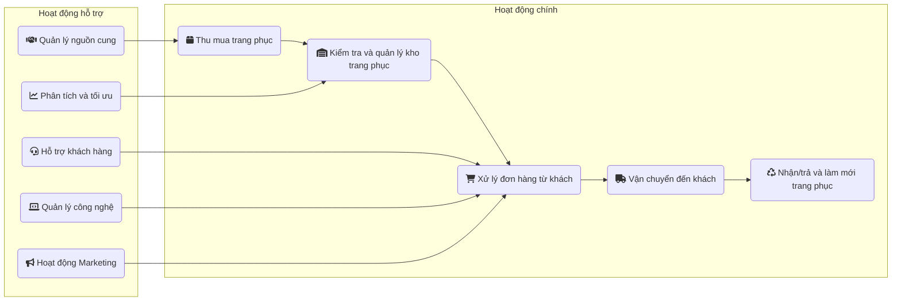
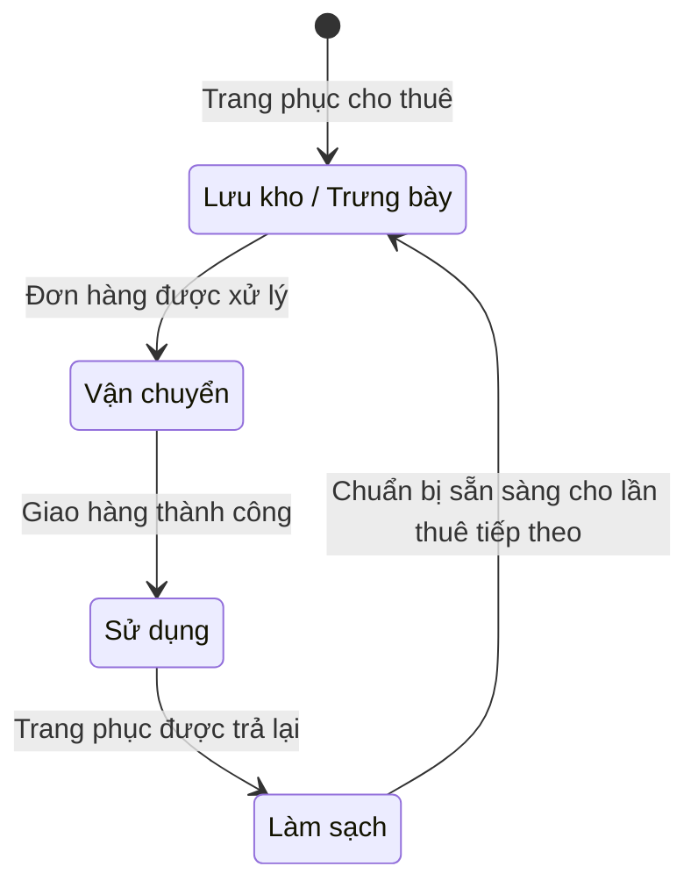

Có duyên được tiếp xúc với những start-up thành công và đang trên đường tìm đến thành công cũng xem như là một trải nghiệm rất thú vị.

## 2019
Mình gặp một start-up fintech, khai thác mảng tài chính cá nhân với gói tài chính dưới chuẩn. Chỉ đến khi họ mở chi nhánh giao dịch thứ 7 dưới hình thức nhượng quyền thì mới cân bằng doanh thu và chi phí vận hành. Cổ đông thở một hơi thật dài.

## 2020
Một start-up về digital marketing service khuấy đảo CMO với real-time dashboard với cách approach sản phẩm rất ngách cũng rất tech. Một năm sau, đội ngũ sống nhờ việc bán sách. Nửa năm sau nữa, mỗi người một ngả.

## 2021
Mình gặp một mô hình bán lẻ kết hợp thương mại điện tử cho nhóm sản phẩm kỹ thuật cơ khí tương tự Mr. DIY. Họ có 1 sàn, 2 app, 3 điểm bán và gần 30 nhân sự. Cũng có traffic, cũng có transactions, nhưng... không có lợi nhuận. Một năm sau, ai về nhà nấy.

## 2022 -  Start-up thời trang
> Start-up này mình có trả học phí, giờ chia sẻ lại để làm bài học!
{: .prompt-important }

{: lqip="data:image/webp;base64,UklGRloAAABXRUJQVlA4IE4AAACwAQCdASoQAAwABUB8JYwCdACwkD0AAP7V62guvqv80q7Uk16ndnQvT4lGAMKKGqkRmx/Q4k2KUubh0Zrx4vjuVa9LwGeBq2mYoPpvAAA=" }
_Hà Nội - 2022_

Mình ra Hà Nội, cắm dùi ở khách sạn của một người bạn vài tuần để xem xét cho một dự án start-up về thời trang. Founder xuất thân ngành thời trang, đã bán công ty cũ `Eva de Eva - Sitcom 2018-2019` và mở dự án mới.
Tham vọng sẽ là start-up công nghệ hoạt động trong lĩnh vực thời trang cho thuê, có mô hình vận hành tương đối giống [Rent the runway](https://www.renttherunway.com). Mục tiêu giai đoạn đầu là xây dựng nền tảng vận hành nhằm thực hiện:
### Mô hình kinh doanh

_Lưu đồ vận hành mình dùng Mermaid để vẽ. Thử nghiệm thôi, cảm thấy chưa hợp thẩm mỹ lắm!_
### Thị trường
**Thị trường thử nghiệm:** Thời trang thể thao. Khai thác tính đặc thù của nhóm khách hàng chơi golf. Bởi, sau khi đã check-in trên sân, người chơi sẽ không mặc lại set đồ đó lần 2.

Khi đem ra để đàm luận, cảm giác lúc nào cũng thấy hứa hẹn. Phụ trách tài chính báo lượng vốn cần cho hoạt động đầu tư ban đầu và chi phí cố định. Marketing đưa ra kịch bản tiếp cận thị trường cho tệp khách hàng 60.000 người chơi golf tại Hà Nội và Hồ Chí Minh. Tệp khách hàng trọng tâm là nữ khi họ đóng góp 80% doanh thu mục tiêu.

Khi xem xét đến hoạt động tiếp cận thị trường - *route to market*, việc cân đối giá bán ra sao để có lợi nhuận và tối ưu thời gian đạt điểm hoà vốn luôn là bài toán khó. Điều đó phụ thuộc vào điểm tạo ra lợi nhuận.

### Bản chất
Phút cuối, khi tổng hợp lại các mảnh ghép dòng tiền, sản phẩm, công nghệ, chuỗi dịch vụ và vận hành thì bức tranh mới thể hiện: bản chất mô hình kinh doanh này là transportation. Nó chính là điểm tạo ra lợi nhuận cho mô hình này.

- `Trang phục` cho thuê sẽ có 4 trạng thái chính:
	- Lưu kho/Trưng bày
	- Vận chuyển
	- Sử dụng
	- Làm sạch

### Vấn đề
#### Lợi nhuận
Trong chu trình vận hành 4 trạng thái của `trang phục` là: làm sạch, lưu trữ/trưng bày, vận chuyển, sử dụng; chỉ khi `trang phục` đang nằm ở bước sử dụng bên khách hàng thì mới sản sinh lợi nhuận.

Thoạt nghe thấy cũng bình thường. Tuy nhiên, đây là mô hình cho thuê, vì vậy giá dịch vụ phải thật sự thấp. Với giá dịch vụ thấp, chi phí vận hành lớn, để có lợi nhuận thì cần tốc độ xoay vòng `trang phục` càng ngắn càng tốt, vì vậy phải tối ưu lượt khách sử dụng chúng trước khi hết khấu hao. Dù đã cân nhắc trước tính bền của đồ thể thao, nhưng bài toán này vẫn phải giải bằng yếu tố công nghệ.

#### CTO
Như vậy, việc có lợi nhuận hay không sẽ phụ thuộc vào việc tối ưu vận hành và giám sát hành trình `trang phục`. Điều đó phụ thuộc hoàn toàn vào yếu tố công nghệ. Tiếc thay, start-up này không có CTO. Họ out-source toàn bộ, kể cả hệ thống quản lý lẫn các ứng dụng đầu cuối của khách. Một lượng lớn chi phí là để mua `trang phục`, lượng còn lại là được dùng để thuê nhân sự... công nghệ.

Start-up công nghệ, nhưng không có CTO.
Kế hoạch đẹp như mơ, kết thúc cũng không quá bất ngờ.

## 2023 - Bạn & cafe
Mình ghé [thăm bạn cũ](/2023-mot-nam-nhin-lai/#thăm-bạn-cũ). Bạn có một quán cafe phong cách vintage, nằm kế bên sân bay Chu Lai. Ở lại chơi với bạn một buổi, mình đếm được có chưa tới 10 lượt khách ra vào. Sau 3 năm, gần 300 triệu ban đầu, giờ sắp trở thành phế liệu.

{: lqip="data:image/webp;base64,UklGRk4AAABXRUJQVlA4IEIAAAAQAgCdASoQAAwABUB8JZACdADp5H0Kg4VgAP6NH6YaJFs7x4gjfWypfdEt5PXs6qIUnZW3AYi/tKz2T06GCYXAAAA=" }
_Calm_

>Có đôi khi, thành bại là do người chứ không phải trời.
>Đôi lúc, chính mình cũng quên mất bản thân là ai, đang đứng ở đâu, đang mong đợi gì...
{: .prompt-warning}

> Còn tiếp...