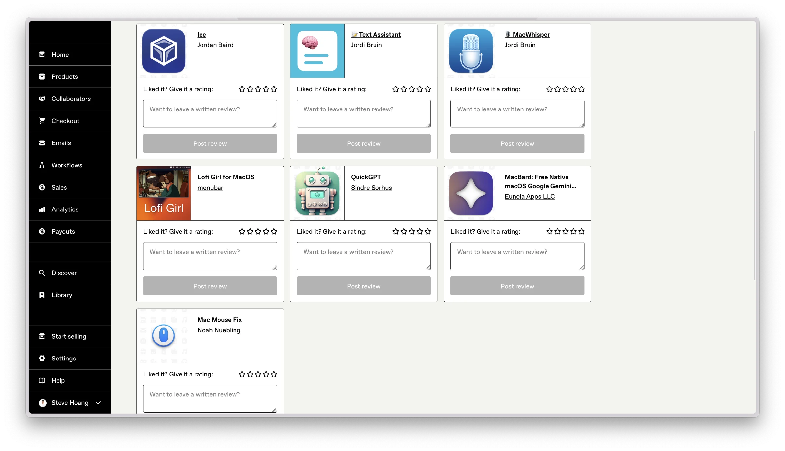

> Mã nguồn của [Gumroad](https://gumroad.com) được công bố hôm qua, ngày 4 tháng 4 tại [Github](https://gumroad.com).
{: .prompt-info}

Mình khá bất ngờ trước việc này nên đã tìm hiểu thêm về họ dù trước đó có từng mua một số phần mềm và digital asset trên Gumroad, nên cũng biết sơ sơ về cách nó vận hành.

{: lqip="data:image/webp;base64,UklGRmAAAABXRUJQVlA4WAoAAAAQAAAADwAAAQAAQUxQSCEAAAAQgmeCAaCCgoKCgmdngoKCgoKgoGegRWdngkVnZ4KCgoIAVlA4IBgAAAAwAQCdASoQAAIABUB8JaQAA3AA/vDmwAA=" w="240" .light}
{: lqip="data:image/webp;base64,UklGRmAAAABXRUJQVlA4WAoAAAAQAAAADwAAAQAAQUxQSCEAAAAQgmeCAaCCgoKCgmdngoKCgoKgoGegRWdngkVnZ4KCgoIAVlA4IBgAAAAwAQCdASoQAAIABUB8JaQAA3AA/vCjQAA=" w="240" .dark}

Gumroad được thành lập vào năm 2011 bởi [Sahil Lavingia](https://sahillavingia.com), có thể hiểu nó như một sàn thương mại điện tử về phần mềm và nội dung số. Thị trường của họ là nhóm người bán cá nhân bán cho cá nhân/doanh nghiệp. Xét về business, có thể xem Gumroad như một trường hợp start-up thành công + drama với những bài học giá trị.

{: lqip="data:image/webp;base64,UklGRpAAAABXRUJQVlA4WAoAAAAQAAAADwAACAAAQUxQSDEAAAARL6CmkRQ46eHqlwoBeCEi4gbch6oGIqhNBgFMBwFeDUz/MvclQUT/JyAHdQ/jnzkKAFZQOCA4AAAA0AEAnQEqEAAJAAVAfCWcAAKdCCG1ZAAA/oo8cXlji5GzbejkxSZcaadJETu8mRxBrqXCMw34AAA="} _Gumroad dashboard_

Trong 14 năm, Gumroad chuyển từ một ý tưởng thử nghiệm đã tăng trưởng và trở thành một doanh nghiệp tinh gọn và có lợi nhuận. Mình tổng hợp thông tin dựa trên dữ liệu tài chính, các phát biểu công khai và bình luận trong ngành tính đến ngày 4 tháng 4 năm 2025 để viết bài này nhằm làm ví dụ về một trường hợp đáng học hỏi cho những ai đang và sẽ đi trên con đường start-up, trong đó có mình.

## Cổ phần và đội ngũ ban đầu

Gumroad có khởi đầu khá khiêm tốn: Founder - Lavingia, lúc đó còn là nhân viên design tại Pinterest. Ảnh có ý tưởng và xây dựng bộ khung nền tảng rồi đi huy động 8,1 triệu USD vào năm 2012 từ các nhà đầu tư lớn như Kleiner Perkins và Chris Sacca - [TechCrunch - 2015](https://techcrunch.com/2015/05/07/gumroad-lays-off-staff). 

### Biến cố
Ảnh cầm tiền về gom một đội ngũ khoảng 20 người, mục tiêu là tăng trưởng càng nhanh càng tốt. Đến năm 2015, khối lượng giao dịch trên Gumroad đạt 40 triệu USD/năm không đáp ứng kỳ vọng tăng trưởng như mong muốn của VC dẫn đến vòng gọi vốn Series B thất bại. Lavingia phản ứng bằng cách giảm đội ngũ đầu tiên xuống còn 5 người, sau đó là còn một mình ảnh - tự điều hành - chuyển định hướng hoạt động của Gumroad sang lợi nhuận thay vì tăng trưởng - [Lavingia - 2019](https://sahillavingia.com/reflecting).

Thay đổi này ảnh hưởng lớn đến nhóm đội ngũ ban đầu. Một người gia nhập tháng 8 năm 2012 nhận 0,5% vốn cổ phần (equity), sau khi bị Lavingia sa thải năm 2015, số cổ phần đó bay theo lời hứa và không còn giá trị, mặc dù Gumroad vẫn tạo ra doanh thu - Mình không có thông tin và bằng chứng gì về vụ drama này, song nó khá ầm ĩ nên cũng dễ tìm - [Hacker News - 2025](https://news.ycombinator.com/item?id=43580103).

Sau khi tan đàn xẻ nghé, nhóm nhà đầu tư bán lại cổ phần mà mình đã mua cho Lavingia với giá 1 USD - giao dịch được xác nhận - mọi người cũng từ bỏ giấc mơ IPO, đồng nghĩa với mọi khoản đầu tư/cổ phần trước đó đều hoá hư không. Bởi, trong mô hình vốn cổ phần startup, quyền chọn cổ phiếu(cổ phần) thường phụ thuộc vào sự kiện thanh khoản (như IPO hoặc mua lại); nếu không, giá trị doanh nghiệp có thể giảm.

### Thành công
{: lqip="data:image/webp;base64,UklGRqQAAABXRUJQVlA4WAoAAAAQAAAADwAACAAAQUxQSDEAAAARL6CmkRQ46eHqlwoBeCEi4gbch6oGIqhNBgFMBwFeDUz/MvclQUT/JyAHdQ/jnzkKAFZQOCBMAAAA0AEAnQEqEAAJAAVAfCWUAALnVzLOlgAA/rfrDWS1MVJ+EuePL96aVSNH9uImtKDf8CcCA8cIHutRNC7fB5Rw+mlrUAASAzMgC9cUAA=="} _Gumroad_

Đến 2023, khi Gumroad công bố sự thành công với:
- Quy mô doanh thu khoảng 22 triệu USD.
- Lợi nhuận đạt 8,9 triệu USD (từ lỗ 1 triệu USD trước đó).
- Chia cổ tức 5 triệu USD qua Flexile
Những người năm đó tham gia xây dựng từ vạch xuất phát dù từng được chia cổ phần, nhưng đến khi công ty phát triển, có thành quả thì họ lại chẳng nhận được quả nào.

Các hồ sơ công khai không ghi nhận bất kỳ đồng sáng lập nào cùng Lavingia cho Gumroad, mặc dù có những người tham gia đồng hành từ những ngày đầu như Ryan Delk - [Hacker News - 2025](https://news.ycombinator.com/item?id=43580103).

> Bạn được chia cổ phần, nhưng nếu bạn không phải là đồng sáng lập - *co-founder* thì luôn có khả năng mất đi số cổ phần từng được hứa hẹn đó. Nó sẽ bay đi cùng tuổi thanh xuân mà bạn đã cống hiến cho start-up đó. Đây là một vấn đề có thật trên thế giới và cũng là thách thức của các startup khi được VC - Venture Capital đầu tư và hỗ trợ để thoái vốn (sớm) hoặc tiến tới IPO.
{: .prompt-important}

Lavingia cũng có nhắc đến việc hỗ trợ cho một số thành viên ban đầu, dù chi tiết này không rõ ràng và cụ thể là ai, bao nhiêu, khi nào. Một cựu nhân viên của Gumroad nói rằng: Mặc dù không còn cổ phần, tuy nhiên cơ hội và trải nghiệm giá trị nhất khi làm việc tại đó là về mặt nghề nghiệp và mở rộng các mối quan hệ.

### ...
Mình chợt nhớ tới tựa sách `Sometime you win, sometime you learn...` của  John C. Maxwell. Những ngày còn nhỏ yếu, các doanh nghiệp luôn khát khao tuyển dụng được người tài về xây dựng và vun đắp cho nó lớn mạnh.

Nhưng sau đó, thì sao... trải nghiệm này - [mình từng có](/goodbye-thai-khuong).

Việc cân bằng và hài hoà lợi ích giữa các bên cũng nên xem xét đến những nhân tố đã từng đóng góp. VC tuy có lý của VC, nhưng mà `Ai cũng phải bắt đầu từ đâu đó` *- Hieuthuhai*. Đôi khi, việc ghi nhận sự cống hiến cũng có giá trị và ý nghĩa lớn lao.

## Công khai mã nguồn

Ngày 3 tháng 4 năm 2025, Gumroad công khai mã nguồn trên GitHub dưới profile “Antiwork” - một brandname về công cụ tự động hóa [GitHub: Antiwork](https://github.com/antiwork).

### Mã nguồn



Lavingia gọi đây là sự kiện “Gumroad trở thành mã nguồn mở” trên [X - 2025](https://x.com/shl/status/1908090697984426227), chuyện này lại dẫn đến một hồi drama khác trên [Hacker News - 2025](https://news.ycombinator.com/item?id=43580103) khi nhiều người nói rằng việc này chỉ là *công khai mã nguồn*, không phải là mở mã nguồn để *Gumroad trở thành mã nguồn mở*, vì:
- Giấy phép sử dụng của Gumroad giới hạn cho doanh nghiệp dưới 1 triệu USD doanh thu (2024) hoặc 10 triệu USD GMV, hoặc tổ chức phi lợi nhuận và chính phủ, điều chỉnh theo lạm phát.
- Không đáp ứng nguyên tắc về Định nghĩa Mã nguồn mở theo [OSI](https://opensource.org/osd) và quyền tự do không hạn chế của Định nghĩa Phần mềm Tự do [FSF](https://www.gnu.org/philosophy/free-sw.en.html).

### Tinh gọn
Dựa theo mã nguồn mà Gumroad công bố với kiến trúc tinh gọn, chúng vận hành với nhóm công cụ tích hợp qua các API bên thứ ba như:
- Stripe và PayPal cho thanh toán
- OpenAI cho kiểm duyệt nội dung
- TaxJar, IRAS và VatStack cho hoạt động khai báo, khấu trừ thuế

Gumroad vận hành không khác gì một website bán hàng mà mọi người thường thấy, gắn công cụ của các bên khác lên rồi thu phí của người bán. Chỉ là, Gumroad thì bán toàn cầu và có khả năng xử lý số lượng lớn giao dịch trong khi ít hao phí nguồn lực (nhân sự, tài chính, thời gian) hơn cách mà các trang web tại Việt Nam đang làm.

## Vận hành
### Nhân sự linh hoạt
Chiến lược vận hành của Gumroad cũng khá khác biệt khi không sử dụng nhân viên toàn thời gian từ năm 2016, kể cả founder - [Lavingia - 2021](https://sahillavingia.com/work). Đến năm 2021, Gumroad sử dụng hơn 25 cộng tác viên bán thời gian, 2023 tăng lên hơn 30 người; phối hợp làm việc theo phương thức không đồng bộ thông qua GitHub và Notion.

Gumroad trả thù lao thường kết hợp tiền mặt và vốn cổ phần, họ từng đăng tin tuyển Kỹ sư Thiết kế cho năm 2024 với mức lương 440,000 USD thu hút 2,000 ứng viên - [LinkedIn - 2023](https://www.linkedin.com/in/sahillavingia). Mô hình hoạt động “không họp, không hạn chót” này mang lại doanh thu 22 triệu USD vào năm 2023.

{: lqip="data:image/webp;base64,UklGRogAAABXRUJQVlA4WAoAAAAQAAAADwAACAAAQUxQSDEAAAARL6CmkRQ46eHqlwoBeCEi4gbch6oGIqhNBgFMBwFeDUz/MvclQUT/JyAHdQ/jnzkKAFZQOCAwAAAAsAEAnQEqEAAJAAVAfCWkAALnYQ8gpAD+ymZHbjOTfBRgHxQuU1XPWxdTG2j0AAAA"} _Issues của Gumroad trên GitHub_

Việc công khai mã nguồn vào ngày hôm qua - tháng 4 năm 2025 phù hợp với cách tiếp cận này, nếu bạn xem các issue về mã nguồn của Gumroad trên Github bạn cũng sẽ thấy được các mức tiền thưởng cho việc sửa mã giành cho các lập trình viên mã nguồn mở. Điều này có thể thu hút nhà phát triển cho đóng góp theo dự án. Lavingia cũng từng nhắc đến đề xuất mở rộng quy mô nhân sự lên 300 cộng tác viên, dùng hoán đổi vốn cổ phần để quản lý dòng tiền - [Podcast - 2023](https://foundersjournal.com/episode/sahil-lavingia).

### Văn hoá làm việc phân tán
Cấu trúc vận hành linh hoạt và tinh gọn này lại trái ngược với mô hình nhân sự mà các VC vẫn thường tài trợ. Mặc dù chúng có vẻ ưu việt và thể hiện sự hiệu quả hơn hệ thống quản lý truyền thống; một số nhà phân tích nghi ngờ khả năng mở rộng cho doanh nghiệp lớn. Mình cũng vậy - dù không phải chiên da hay nhà phân tích/đầu tư gì.

Xu hướng văn hoá làm việc phân tán ở nước ngoài như thế này ngày một nhiều. Chiến lược lao động của Gumroad cho thấy việc vượt qua sự hạn chế tài nguyên của các start-up cũng không phải là không có cách.

[Obsidian](/obsidian) cũng là một start-up vận hành theo cách tương tự và khá thành công. Một team 5 người, vận hành và phát triển một ứng dụng đa nền tảng (Linux, Windows, Mac, Android, iOS) trên phạm vi toàn cầu.

## VC
### Tác động
Sự phát triển của một start up như Gumroad cũng có phần từ sự tác động của các VC. Mặc dù cách họ tác động không tích cực như việc đặt mục tiêu tăng trưởng lên rất cao hay góp phần tan rã đội ngũ ban đầu để thoái vốn.

Hầu như ai khởi nghiệp cũng mong tìm kiếm được cho mình những quỹ đầu tư có năng lực tài chính, có hệ sinh thái tương hợp, có tiếng nói. Nhưng, đôi lúc, thực tế lại thường không được vẹn tròn như vậy. Giả định một start-up nhận được 10 triệu USD từ quỹ, và chúng thường sẽ phải đi qua các bước kiểm soát, quản lý, thay đổi hình thức đầu tư, ký thác.v.v. để rồi khi tới tay, cục tiền đầu tư đó cũng không còn tròn vẹn nữa.

### Một góc khác
Như một lẽ đương nhiên, khi start-up/doanh nghiệp nhận được sự tán thành và đầu tư từ quỹ nào đó, thì chính quỹ đó cũng sẽ tìm cách tác động và can thiệp vào hoạt động vận hành của doanh nghiệp đó. Thường thấy là:
- Điều chỉnh mục tiêu kinh doanh:
  - Cưỡng ép tốc độ giải ngân và mở rộng, trực tiếp đưa doanh nghiệp vào giai đoạn tăng trưởng nóng nhằm chiếm thị phần.
  - Rút ngắn tiến độ phát triển sản phẩm để bước sang giai đoạn khai thác.
- Thay đổi cơ cấu quản lý, quyền lực và phân bố nhân sự.

Cốt lõi của một start-up, ngoài con người và mô hình lý tưởng ra, có lẽ chỉ còn lại là giấy và những giấc mơ.