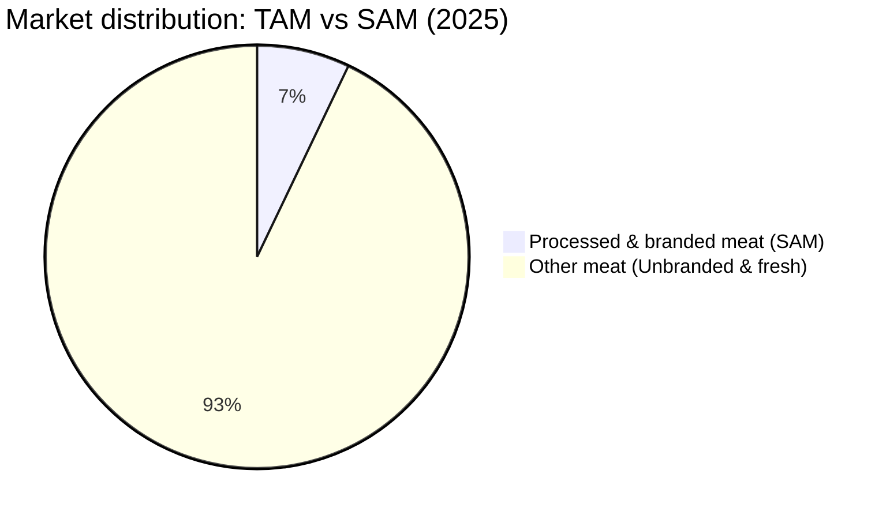
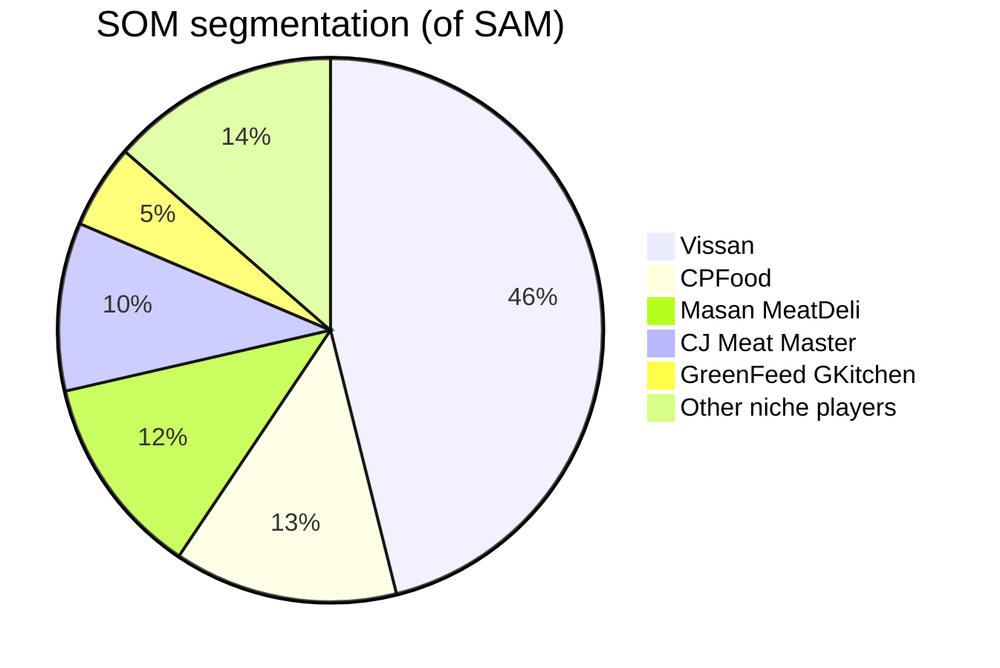

> I found some interesting bullet points after conducting quick research on the consumer side of the meat market in Vietnam.
> Date `April 26, 2025`
{: .prompt-info}

## Key points

- Vissan leads with a 46.1% share of the processed meat segment (SAM) in urban Vietnam.
- CPFood and Masan MeatDeli follow with 13.3% and 12% of SAM respectively.
- CJ Meat Master and GreenFeed GKitchen capture 10% and 5% of SAM, while other niche players share the remaining 13.6%.
- The overall Vietnamese meat market (TAM) is estimated at USD 8.36 billion in 2025, with the processed/branded segment (SAM) at USD 593.6 million.

## Market overview

Vietnam’s meat consumption continues to grow, driven by rising incomes, urbanization, and changing consumer preferences for safety and convenience. The total market (TAM) is projected at USD 8.36 billion in 2025, serving approximately 84.6 million meat consumers. Within this, the processed and branded meat segment (SAM) accounts for USD 593.6 million (7.1% of TAM) in urban areas.

## Competitive landscape

Major brands like Vissan (46.1% of SAM), CPFood (13.3%), Masan MeatDeli (12%), and CJ Meat Master (10%) dominate the processed meat segment, while GreenFeed GKitchen and other niche players split the remainder.

### TAM vs SAM

- TAM (Total Addressable Market): USD 8.36 billion (100% of the market).
- SAM (Serviceable Addressable Market): USD 593.6 million (7.1% of TAM), focusing on processed/branded meat in urban areas.

### SOM breakdown

- Serviceable obtainable market (SOM): Realistic short-term capture of SAM by key players:
  - Vissan: USD 273.6 million (46.1% of SAM)
  - CPFood: USD 78.9 million (13.3% of SAM)
  - Masan MeatDeli: USD 71.2 million (12% of SAM)
  - CJ Meat Master: USD 59.4 million (10% of SAM)
  - GreenFeed GKitchen: USD 29.7 million (5% of SAM)
  - Other niche players: USD 80.8 million total (13.6% of SAM)

### Competitive profile matrix

| No. | Key factors                     |  Masan |     CJ | CPFood | Vissan | GreenFeed | Others |
| --- | ------------------------------- | -----: | -----: | -----: | -----: | --------: | -----: |
| 1   | Positioning                     |      4 |      4 |      4 |      5 |         3 |      2 |
| 2   | Pricing                         |      5 |      3 |      4 |      4 |         3 |      3 |
| 3   | Product innovation              |      4 |      4 |      4 |      5 |         3 |      2 |
| 4   | Promotion                       |      4 |      4 |      4 |      5 |         3 |      2 |
| 5   | Presence (Distribution & E-com) |      4 |      4 |      4 |      5 |         3 |      2 |
| 6   | Personalization & transparency  |      3 |      3 |      3 |      4 |         3 |      1 |
| 7   | Place (Retail strategy)         |      4 |      4 |      4 |      5 |         3 |      2 |
|     | **Total points**                | **28** | **26** | **27** | **33** |    **21** | **14** |
|     | **SOM (USD million)**           |   71.2 |   59.4 |   78.9 |  273.6 |      29.7 |   80.8 |

## Market trends & forecast

- **Consumption growth**: Meat consumption per capita is projected to increase steadily, reflecting rising incomes and urbanization in Vietnam.
- **TAM forecast**: With a CAGR of approximately 5.12% between 2023 and 2029, the total meat market is expected to grow from *USD 8.36B in 2025* to about *USD 10.2B by 2029*.
- **Processed segment outlook**: The processed and branded meat segment is poised to expand in line with overall market growth, potentially reaching *USD 650M* by 2029, driven by convenience trends and premium product innovations.
- **E‑commerce surge**: Online meat sales have grown at a *35.7% CAGR* from 2018 to 2023 and are forecast to continue outpacing traditional channels, potentially accounting for over *1.5% of total meat sales by 2028*.
- **Premium & value‑added products**: Demand for chilled, ready‑to‑cook, and premium meat products is rising, with consumers increasingly willing to pay a premium for quality, safety, and convenience.
- **Sustainability focus**: Leading companies like CPFood and GreenFeed are investing in traceability systems and eco‑friendly packaging to meet growing consumer concerns about food safety and environmental impact.

## Conclusion
{: lqip="data:image/webp;base64,UklGRowAAABXRUJQVlA4WAoAAAAQAAAADwAACQAAQUxQSC8AAAARL6CobRs49S6Ne7AWEXHG8aGqgQhqk0EA00GAVwPTv8z9KRDR/wnIQd3D+GOOAgBWUDggNgAAALABAJ0BKhAACgAFQHwlnAAC50edzwAA/rgj19aYBrY20lpnr09LtrrdyNihfGv6yzjRkgAAAA==" w='680px' .light}
{: lqip="data:image/webp;base64,UklGRnIAAABXRUJQVlA4WAoAAAAQAAAADwAACQAAQUxQSC8AAAARL6CobRs49S6Ne7AWEXHG8aGqgQhqk0EA00GAVwPTv8z9KRDR/wnIQd3D+GOOAgBWUDggHAAAADABAJ0BKhAACgAFQHwlpAADcAD+74I4NjBnAAA=" w='680px' .dark} _Vietnamese meat market - [the map](https://think.stevehoang.com/#---%0Amw:%20800%0A---%0A%0A#%20Vietnam%20meat%20market%20-%202025%0A%0A##%20Overview%0AThis%20board%20summarizes%20the%20TAM,%20SAM,%20and%20SOM%20for%20the%20Vietnamese%20meat%20market,%20focusing%20on%20processed/branded%20meat%20in%20urban%20areas.%20It%20aligns%20with%20the%20concentric%20circle%20chart,%20where:%0A-%20**TAM**:%20USD%208.36%20billion%20(entire%20meat%20market,%2084.6M%20consumers).%0A-%20**SAM**:%20USD%20593.56%20million%20(processed/branded%20meat,%2029.7M%20urban%20consumers).%0A-%20**SOM**:%20Segmented%20by%20key%20players%20(Vissan,%20CPFood,%20Masan%20MeatDeli,%20CJ%20Meat%20Master,%20GreenFeed%20GKitchen,%20Others).%0A%0A##%20Key%20Insights%0A1.%20**TAM%20(USD%208.36B)**:%0A%20%20%20-%20Encompasses%20all%20meat%20consumption%20(fresh,%20frozen,%20processed)%20across%20Vietnam%E2%80%99s%2084.6M%20consumers.%0A%20%20%20-%20Dominated%20by%20unbranded%20meat%20(90%25)%20in%20wet%20markets,%20limiting%20branded%20players%E2%80%99%20reach.%0A%20%20%20-%20Marketing%20challenge:%20Converting%20wet%20market%20shoppers%20to%20branded%20products%20via%20safety%20and%20convenience%20messaging.%0A%0A2.%20**SAM%20(USD%20593.56M)**:%0A%20%20%20-%20Focuses%20on%20processed/branded%20meat%20in%20urban%20areas%20(29.7M%20consumers),%20driven%20by%20supermarkets%20(16.9%25%20of%20sales)%20and%20e-commerce%20(0.4%25,%2035.7%25%20CAGR).%0A%20%20%20-%20Marketing%20strategies%20emphasize%20quality,%20affordability,%20and%20digital%20presence%20to%20capture%20urban%20consumers.%0A%20%20%20-%20Constraint:%20Rural%20markets%20prefer%20unbranded%20meat,%20reducing%20SAM%20scope.%0A%0A3.%20**SOM**:%0A%20%20%20-%20**Vissan%20(USD%20273.63M,%2046.1%25)**:%20Leads%20due%20to%20strong%20brand%20trust%20(Positioning:%205),%20nationwide%20distribution%20(Place:%205,%2039,000+%20outlets),%20and%20heavy%20promotion%20(5).%20Excels%20in%20processed%20meat%20variety%20(Product:%205).%0A%20%20%20-%20**CPFood%20(USD%2078.94M,%2013.3%25)**:%20Leverages%20sustainability%20(Positioning:%204)%20and%20integrated%20supply%20chain%20(Place:%204),%20appealing%20to%20eco-conscious%20urbanites.%0A%20%20%20-%20**Masan%20MeatDeli%20(USD%2071.23M,%2012%25)**:%20Dominates%20in%20affordability%20(Pricing:%205),%20targeting%20mass-market%20urban%20consumers%20via%20e-commerce%20and%20supermarkets%20(Presence:%204).%0A%20%20%20-%20**CJ%20Meat%20Master%20(USD%2059.36M,%2010%25)**:%20Focuses%20on%20premium%20chilled%20meat%20(Product:%204),%20but%20higher%20pricing%20(3)%20limits%20share.%0A%20%20%20-%20**GreenFeed%20GKitchen%20(USD%2029.68M,%205%25)**:%20Niche%20leader%20with%20clean%20meat%20focus%20(Personalization:%204),%20strong%20in%20urban%20retail%20(Place:%204).%0A%20%20%20-%20**Others%20(USD%2029.70M,%205%25)**:%20Limited%20by%20weak%20branding%20(Positioning:%202)%20and%20distribution%20(Place:%202),%20targeting%20regional%20or%20niche%20pork%20segments.%0A%0A4.%20**Marketing%20Implications**:%0A%20%20%20-%20**Vissan**:%20Maintains%20dominance%20through%20broad%20appeal%20and%20scale;%20could%20innovate%20further%20in%20e-commerce.%0A%20%20%20-%20**CPFood/Masan**:%20Compete%20on%20sustainability%20and%20affordability,%20respectively;%20need%20stronger%20personalization%20to%20rival%20Vissan.%0A%20%20%20-%20**CJ**:%20Should%20expand%20affordable%20options%20to%20grow%20share.%0A%20%20%20-%20**GreenFeed**:%20Can%20grow%20by%20scaling%20digital%20campaigns%20and%20sustainability%20messaging.%0A%20%20%20-%20**Niche%20Players**:%20Require%20investment%20in%20branding%20and%20distribution%20to%20compete%20beyond%20local%20markets.%0A%0A)_

The Vietnamese meat market presents a substantial opportunity, with the processed/branded segment offering targeted growth potential. Vissan’s leadership (46.1% of SAM) underscores the importance of strong branding, quality assurance, and distribution reach. Meanwhile, companies like CPFood and Masan MeatDeli leverage sustainability and affordability, respectively, to capture meaningful market shares.

Sources
: - [Vietnam Meat Market By Size, Share & Forecast 2029F](https://www.techsciresearch.com/report/vietnam-meat-market/8178.html) - TechSci Research
: - [Vietnam’s Meat Market: Mind the Gap!](https://www.ipsos.com/en/vietnams-meat-market-mind-gap) - Ipsos
: - [Sector Trend Analysis – Meat in Vietnam](https://agriculture.canada.ca/en/international-trade/market-intelligence/reports/sector-trend-analysis-meat-vietnam) - Agriculture and Agri-Food Canada
: - [Vietnam Meat Market Size Share Forecast 2024-2032](https://www.imarcgroup.com/vietnam-meat-market) - IMARC Group
: - [VISSAN Story](https://www.vissan.com.vn/en/about-us/vissan-story) - VISSAN
: - [GREENFEED Vietnam Corporation](https://www.greenfeed.com.vn/en)
: - [Masan develops branded meat division](https://www.foodnavigator-asia.com/Article/2019/07/26/Masan-develops-branded-meat-division) - FoodNavigator-Asia
: - [CP Vietnam named among top 100 sustainable companies in Vietnam](https://www.cpfworldwide.com/en/media-center/1085) - CPF Worldwide