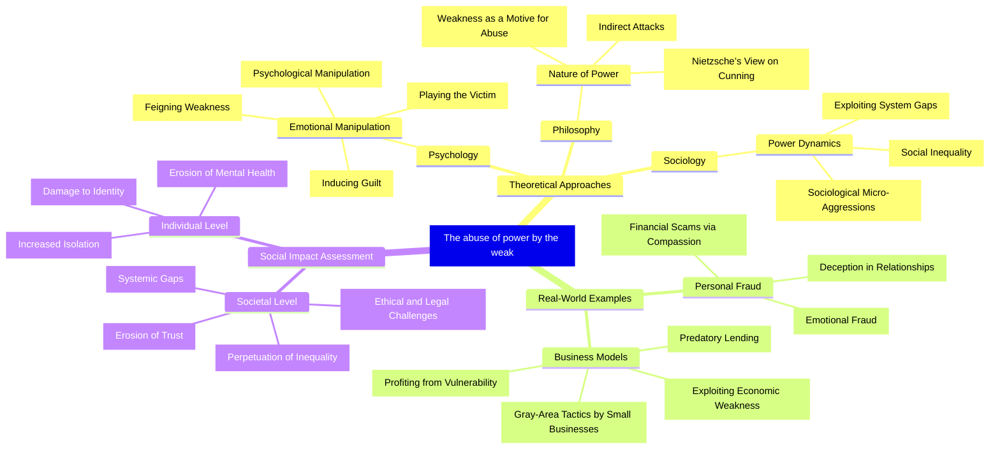

> Today, while scrolling through social media, I came across the phrase _The abuse of power by the weak_, originally from the Korean term `약자의 횡포`, which translates to the oppression by the weak.
> 
> _It refers to actions that violate the law or harm others simply because someone is weak (or desperate) and acts out of a need to survive (from street vendors, beggars, or even scammers, etc.)_


> _The post is very long with multiple perspectives, so consider reading carefully to fully grasp the content!_  
{: .note-important }

## Introduction

The phrase _The abuse of power by the weak_ left a strong impression on me. It’s almost haunting. It reminds me of recent stories in the U.S., like the case of Anna Sorokin (aka Anna Delvey), who posed as a struggling heiress to scam wealthy individuals and businesses, or the surge in crowdfunding fraud on platforms like GoFundMe, where individuals exploit sympathy with fabricated stories of hardship. Some influencers leverage their platforms to post negative reviews of products or services to extract benefits from brands.

Few may recall the controversy surrounding the “Taco Bell rat” video, where staged claims about food contamination were used to pressure businesses for financial gain.

At first glance, these might seem like simple scams, but upon digging deeper, I realized this behavior can be seen as a distinct reaction pattern of a group of people, following a certain logic, and it’s a growing trend that could become a societal issue in the modern world. This phenomenon may not have existed in human history before… or perhaps it hasn’t been fully defined or adequately addressed.

I searched for related sociological literature and topic terms like _The Abuse of Power by the Weak_, but found only a few incomplete concepts in philosophy[^1], psychology[^2], and politics[^3].

> _This article could have a significant impact, or it might get buried in history, becoming raw material for AI’s linguistic and logical analysis of human society._

_If that happens, it would be such a shame…_

---

{: lqip="data:image/webp;base64,UklGRlYAAABXRUJQVlA4IEoAAADQAQCdASoQAAsABUB8JZgCdAC955NwAAD94pPrGbaRPBVIFUjsBAOS8w+GSI94SNIymaFN7Z/Nk2QCe+rSFcI4hvBbdrJAmgAAAA=="} _The weak - Joseph Lockley_

Typically, people associate power with the strong—those who impose dominance over the weak through authority, resources, or influence.

However, beneath the surface lies another type of behavior: individuals or groups using their weakness or misfortune as a weapon to manipulate, exploit, and control others in a sophisticated and highly effective way, causing destruction.

It’s worth examining the nature of this issue for a multidimensional perspective: From emotional fraud in close relationships to predatory business models, you’ll see _how weakness becomes a strategic tool to gain an advantage over those with traditional forms of power._



## The Paradox

The abuse of power by the weak represents a fundamental reversal of traditional power dynamics. Unlike conventional abuse, where strength dominates weakness, this phenomenon involves the calculated exploitation of one’s vulnerability to gain an advantage over others. It’s a form of “psychological aikido”—using an opponent’s strength against them by appearing helpless while orchestrating sophisticated, manipulative actions.

This behavior is distinct from mere opportunism. It involves deliberate, sustained efforts to exploit others’ compassion, guilt, or societal obligations under the guise of weakness. The manipulator presents themselves as a victim or protector while simultaneously engineering situations to gain benefits or control.

This creates a paradox:

Those with traditional power are bound by societal expectations, legal frameworks, and moral obligations—yet these constraints don’t equally apply to those perceived as weak.

Examples:

- **Simple**: A homeless person might engage in disruptive behavior in a public space, and society or moral norms might excuse their actions but not those of a wealthy individual if roles were reversed.
- **Deeper**: A manager may be held accountable for a team’s failure to meet KPIs, but an employee might use emotional appeals to manipulate the manager for leniency or reduced accountability.
- **Obvious**: The financial moves of wealthy individuals (e.g., Elon Musk, Jeff Bezos) are heavily scrutinized by the media, while someone claiming hardship (e.g., Anna Sorokin posing as a struggling heiress) can exploit compassion to extract resources without equivalent scrutiny.

## Theory

### Psychology: Emotional Warfare

From a psychological perspective, the abuse of power by the weak operates through emotional manipulation, primarily by exploiting humans’ natural tendencies toward compassion and social morality.

Manipulative behaviors rely on several key mechanisms:

**Self-Victimization**: The manipulator constructs an image of themselves as a victim, intentionally maintaining this status to extract concessions from others. They may not be truly weak but exploit the perception of weakness by systematically crafting narratives to position themselves as victims.

**Gaslighting**: This involves exploiting victims’ cognitive dissonance, making them feel guilty for suspecting that a seemingly harmless or unfortunate person is manipulating or controlling them.

**Emotional terrorism**: This manifests as threats of self-harm, dramatic emotional displays, or other behaviors that create a crisis demanding immediate attention and compliance from the victim.

Often, such manipulators display high emotional intelligence but seem to lack genuine self-respect.

### Sociology: Power as Currency

From a sociological perspective, the weak can abuse power when they know how to exploit societal inequalities and expectations.

> Power is **that which achieves goals despite resistance**.
> 
> Max Weber  
{: .author }

Modern society creates gaps that enable the abuse of power by the weak:

- Social welfare systems, while necessary to protect genuinely vulnerable groups, can be exploited by manipulators for profit.
- Social norms like prestige and status make those who pursue or possess them vulnerable to exploitation by those hiding behind weakness or misfortune, using guilt or societal obligations.

The rise of the internet and social media has fostered a new type of society where people invest more time in virtual relationships than real human connections.

Examining the relationship between fraud cases, the value of assets lost to fraud, and the growth of society and the internet in the U.S. over the past 30 years (1995–2025) reveals a clear correlation:

```chart
{
  "type": "line",
  "data": {
    "labels": ["1995", "2000", "2005", "2010", "2015", "2020", "2025"],
    "datasets": [
      {
        "label": "Fraud Complaints (thousands)",
        "data": [100, 200, 300, 400, 500, 2200, 2600],
        "borderColor": "rgba(31, 119, 180, 0.3)",
        "backgroundColor": "rgba(31, 119, 180, 0.4)",
        "fill": false,
        "yAxisID": "y-left"
      },
      {
        "label": "Fraud Losses (billion $)",
        "data": [1.0, 2.0, 3.5, 4.0, 6.1, 3.5, 12.5],
        "borderColor": "rgba(255, 127, 14, 0.3)",
        "backgroundColor": "rgba(255, 127, 14, 0.4)",
        "fill": false,
        "yAxisID": "y-right"
      },
      {
        "label": "Internet Penetration (%)",
        "data": [9, 43, 68, 74, 87, 90, 92],
        "borderColor": "rgba(44, 160, 44, 0.4)",
        "backgroundColor": "rgba(44, 160, 44, 0.4)",
        "fill": false,
        "yAxisID": "y-right"
      },
      {
        "label": "Income (thousand $)",
        "data": [50.0, 70.8, 70.2, 67.5, 70.2, 74.6, 76.0],
        "borderColor": "rgba(148, 103, 189, 0.4)",
        "backgroundColor": "rgba(148, 103, 189, 0.4)",
        "fill": false,
        "yAxisID": "y-left"
      }
    ]
  },
  "options": {
    "responsive": true,
    "scales": {
      "x": {
        "title": {
          "display": true,
          "text": "Year"
        }
      },
      "y-left": {
        "type": "linear",
        "position": "left",
        "title": {
          "display": true,
          "text": "Fraud Complaints (thousands) / Income (thousand $)"
        },
        "grid": {
          "drawOnChartArea": false
        }
      },
      "y-right": {
        "type": "linear",
        "position": "right",
        "title": {
          "display": true,
          "text": "Fraud Losses (billion $) / Internet Penetration (%)"
        },
        "grid": {
          "drawOnChartArea": false
        }
      }
    },
    "plugins": {
      "title": {
        "display": true,
        "text": "Correlation of Fraud, Income, and Internet Growth (1995–2025)"
      },
      "legend": {
        "display": true,
        "position": "top"
      }
    }
  }
}
```

**Notes**:

- **Fraud Complaints**: Estimated values; FTC data shows $2.4M in 2022, $2.6M in 2023.
- **Fraud Losses**: Initial estimates; FTC reports $3.5B in 2020, $8.8B in 2022, $10B in 2023, with 2025 projections based on growth trends.
- **Internet Penetration**: Sourced from NTIA and Pew.
- **Income**: Sourced from Pew Research.

_The U.S. is a prime example due to its rapid internet growth over the past 30 years (1995–2025), financial development, and liberal welfare/legal policies, making it ideal for data illustration. Data from other countries is harder to access._

### Philosophy: When Weakness Becomes a Motive

> The weak may abuse their weakness as a form of moral power against the strong.
> 
> Friedrich Nietzsche - Slave Morality  
{: .author }

John Adams argued that “weakness, not wickedness, renders men unfit to be trusted with unlimited power.” The issue here may not always be malicious intent but rather behaviors compensating for desperation born from powerlessness.

At an individual level, this perspective suggests that the abuse of power by the weak may not always be calculated evil but a pathological response to genuine powerlessness. When someone is at rock bottom with nothing left to lose, they may no longer care about higher values like honor or self-respect.

Misfortune is real—their instinctual response to it becomes a source of harm to others.

What about authenticity and accountability?

- When does misfortune become deliberate performance? Benefit or morality?
- How do we maintain compassion for the genuinely unfortunate while avoiding those who exploit that compassion?

These questions are not easily answered…

## Real-World Manifestations

### Emotional: Relationships in Intimate Contexts

**Emotional Fraud** in romantic relationships often involves one partner deliberately feigning weakness to exploit resources, attention, or control from the other. This can manifest as exaggerated financial hardship, fabricated health issues, or orchestrated emotional crises to demand constant attention and concessions. The manipulator creates a dynamic where the partner’s love and commitment become weapons against their own happiness.

**Dependency** leverages parents’ or family members’ compassion—whether real or staged—to extract labor, emotional support, or financial resources, making them feel obligated to help. This is common in families affected by economic hardship or addiction.

**Friendship Exploitation** involves using personal crises, financial struggles, or emotional needs to extract resources, favors, or direct support from friends without reciprocation.

Manipulation in intimate contexts is especially harmful because it exploits humans’ deepest needs for connection, meaning, and purpose.

### Economic: Profiting from Misfortune

The most visible examples are in business, where misfortune, weakness, or the need for protection/support is used to exploit economic benefits.

**Predatory Lending** is a clear example, where financial institutions or businesses offer short-term loans, rent-to-own models, or subprime lending (pawnshops) while presenting themselves as helpers for those unable to access traditional financial services. In reality, they profit through exploitative terms, often creating debt traps that extract far more value than initially provided.

**Compassion-Based Business Models** involve businesses or individuals profiting from their own or others’ hardships through crowdfunding or donation campaigns. For instance, GoFundMe scams often involve fabricated stories of medical emergencies or personal tragedies to solicit donations, exploiting societal compassion.

**Exploiting Regulatory Gaps** refers to the gray areas in business where small companies or new industries operate without clear regulations because they are “too small to regulate” in markets “too large to handle individually.” Yet, they profit from these gaps rather than being prohibited.

> In the U.S., before stricter regulations, some gig economy platforms like Uber or DoorDash classified workers as independent contractors, avoiding taxes and benefits obligations, which allowed drivers to operate in a gray area without full accountability.  
{: .note-info}

### Bypassing Systems: Profiteering

What happens when the weakness or misfortune of many is orchestrated and exploited by individuals or groups with knowledge of organization and management?

Perhaps the most concerning scenario is a flock of sheep led by a wolf.

Consider the case of organized panhandling rings in U.S. cities, where individuals posing as homeless collect money under the guise of personal hardship, but the funds are funneled to coordinators who exploit these “workers” for profit.

{: lqip="data:image/webp;base64,UklGRmIAAABXRUJQVlA4IFYAAADQAQCdASoQAA8ABUB8JZACdADRq8kIAAD+QMrb64PjxE+5sCGA5bHBfsWlEpmnMBkZi1+e2r77KXt+pjYTpfJyApOA1a7LzAbS2RT0WdvQ6XZzT8AAAA=="} _Hypnotic_

**Administrative Manipulation** occurs when manipulators bypass policies, systems, or support mechanisms meant for citizens by profiting or defrauding benefits intended for those in need.

**Exploiting Legal Systems** involves weaponizing laws or policies for profit or control. In the U.S., “slip-and-fall” scams are a common example, where individuals stage accidents in stores or public spaces to file fraudulent lawsuits, exploiting legal protections for victims.

**Political Mobilization** is when victims or profiteers turn legitimate grievances into tools for gaining political power or resources far beyond addressing the original issues. In the U.S., some groups have exploited social justice movements, using claims of marginalization to gain influence or funding without addressing systemic issues.

## Origins and Drivers

### Economic Inequality

{: lqip="data:image/webp;base64,UklGRkYAAABXRUJQVlA4IDoAAADQAQCdASoQAAwABUB8JQAAT/vnnBNAAAD+70pWRt3xQC7BU0rRlL1w0NaPUdyP6l4Cv2YQ3428AAAA"} _The poor - Ben Koorengevel_

Significant wealth disparities create ideal conditions for the abuse of power by the weak. When basic survival is challenging, some individuals may leverage their misfortune to demand resources from those with more. Think of the character George Milton from John Steinbeck’s _Of Mice and Men_, whose struggles reflect desperation that could lead to manipulative behavior.

**The Sense of Responsibility for Wealth** among the better-off is real. In the U.S., cultural values around charity and “giving back” foster a sense of duty toward those less fortunate, which can be exploited by manipulators crafting narratives of hardship.

Think of the individuals posing as veterans or single parents soliciting donations at intersections or online, often part of organized schemes to exploit public goodwill.

### Cultural Shifts

No matter how advanced society becomes, history always lingers. The increasing sensitivity of contemporary culture to victimhood and historical injustices is evident. As moral progress raises ethical standards, it creates new gaps—opportunities for manipulators.

**Therapeutic Culture**—you’ve likely heard of “healing.” As the world advances, people are more aware of mental health concepts. To heal emotional wounds, confronting them directly and sharing for support is often effective. The issue is that emotional needs during therapy can be exploited by those who understand therapeutic language but don’t genuinely engage in healing. The difficulty in treating psychological trauma or emotional needs becomes a guise for manipulation.

### Technology as a Catalyst

Since the rise of social media, anyone can become famous overnight. Digital communication technology has significantly expanded the reach and effectiveness of manipulative power tactics by the weak.

**Social Media Compassion Campaigns** can mobilize widespread support around fabricated or exaggerated personal crises, generating financial aid, social pressure on targets, or attention for virality or influence. Think of cases like the 2018 GoFundMe scam involving a homeless veteran, where a couple fabricated a story to raise over $400,000.

**Digital Emotional Manipulation** operates through carefully curated online presentations of weakness to gain attention, resources, or influence over followers, friends, or romantic targets. Think of influencers who post negative reviews of small businesses to pressure them for free products or payments.

**Crowdfunding Fraud** represents systematic profiteering from fabricated hardship stories, exploiting the difficulty of verifying online claims and societal pressure against questioning apparent victims. Such scams have surged on platforms like GoFundMe and Kickstarter.

## Consequences and Impacts

It’s challenging to distinguish between genuine and fake needs, making society less willing to help those truly in need after being deceived and exploited.

### Psychological Damage

**Cognitive Dissonance** arises when victims struggle to reconcile a manipulator’s apparent helplessness with their actual control over the situation. Victims grapple with balancing compassion for someone seemingly suffering with suspicion of their unusual demands.

**Compassion Fatigue** develops when victims become emotionally exhausted by constant demands for support, attention, or concessions. This can lead to long-term difficulties in forming trusting relationships or responding appropriately to genuine needs.

**Erosion of Moral Values** occurs when victims lose faith in distinguishing real from fake, leading to cynicism and indifference toward genuine kindness or those truly in need.

### Decline in Social Trust

**Skepticism of Compassion** emerges when people become cautious of calls for help, potentially reducing societal support for those genuinely in need. This creates a perverse outcome where manipulators’ actions harm not only their direct victims but also those who truly need help.

**Institutional Dysfunction** develops when organizations struggle to maintain support systems for vulnerable groups while protecting against manipulation. The difficulty in distinguishing leads to cumbersome yet inefficient operations.

**Democratic Decay** can occur when victims are weaponized for political manipulation.

### Economic Distortion

Bypassing systems creates inefficient economic blocks and misallocates resources.

**Market Failures** arise when businesses succeed through compassion manipulation rather than delivering real value, distorting competitive incentives, and reducing overall economic efficiency.

After checking prices on Amazon during Black Friday sales, I no longer trust their “lightning deals.” Retailers may offer low prices, but hidden fees or inflated original prices often make up a significant portion of the cost, unreasonably so…

> This example seems unrelated, but the core issue is individual sellers exploiting market gray areas. They’re too small to register promotions with regulatory bodies, and platforms like Amazon are too large to do it for them. As a result, you buy an item at price x>2, then get a 50% discount.


> In the EU, laws on pricing and promotions require that sale prices be lower than the lowest price in the last 30 days, to prevent inflated prices followed by fake discounts.  
 {: .note-info}

**Resource Misallocation** occurs when support systems are hijacked by manipulators, reducing the effectiveness of welfare systems and potentially sparking political backlash against such programs. Think of the backlash against welfare fraud cases in the U.S., where fabricated claims have led to calls for stricter regulations.

## Solutions

### Individual Strategies

**Setting Boundaries** involves learning to maintain empathy while protecting oneself from manipulation. This requires distinguishing between supporting others and being exploited for compassion or resources. For example, my rule is never to lend money to friends.

**Pattern Recognition Skills** help identify common behaviors to distinguish genuine needs from performative acts. You can spot manipulation when crises occur too frequently or demands escalate over time.

From 2018 to now, I’ve been distributing free meals to the homeless in a U.S. city—organizing, cooking, and delivering myself. I can recognize familiar faces, newcomers, and areas where genuine needs exist versus where “actors” congregate.

**Seeking Support** for external perspectives can help identify manipulation, which is often hard to detect within a relationship.

### Institutional Reforms

Organizations and systems need to optimize approaches to support those in need while controlling profiteering.

**Verification Systems** distinguish genuine needs from profiteers while respecting privacy and dignity.

**Accountability Mechanisms** can create barriers to protect and maintain integrity for those providing support. This requires legal and administrative frameworks that differentiate between honest mistakes and intentional manipulation.

**Awareness Training** for service providers and law enforcement on recognizing and responding to manipulative tactics.

### Cultural and Educational Responses

Raising awareness is essential to balance vigilance without fostering apathy or indifference toward the unfortunate or kindness.

**Media Literacy** includes recognizing manipulative patterns in media channels.

**Relationship Education** covers healthy versus manipulative relationship dynamics, helping people identify and respond to emotional manipulation tactics.

**Critical Empathy Skills** involve maintaining compassion while developing skepticism and appropriate boundaries.

## Summary and Implications

```chart
{
  "type": "radar",
  "data": {
    "labels": [
      "Emotional Manipulation",
      "Strategic Victimhood",
      "Financial Exploitation",
      "Social Coercion",
      "Exploiting Vulnerability",
      "Covert Control"
    ],
    "datasets": [
      {
        "label": "Impact of Weak Power Abuse",
        "data": [8, 9, 7, 7.5, 9.5, 8.5],
        "backgroundColor": "rgba(255, 105, 180, 0.4)",
        "borderColor": "#ff69b4",
        "pointBackgroundColor": "#ff69b4",
        "pointBorderColor": "#fff",
        "pointHoverBackgroundColor": "#fff",
        "pointHoverBorderColor": "#ff69b4",
        "lineTension": 0.2
      },
      {
        "label": "Traditional Power Abuse (Comparison)",
        "data": [6, 4, 9, 8.5, 5, 7],
        "backgroundColor": "rgba(0, 191, 255, 0.4)",
        "borderColor": "#00bfff",
        "pointBackgroundColor": "#00bfff",
        "pointBorderColor": "#fff",
        "pointHoverBackgroundColor": "#fff",
        "pointHoverBorderColor": "#00bfff",
        "lineTension": 0.2
      }
    ]
  },
  "options": {
    "responsive": true,
    "maintainAspectRatio": false,
    "scales": {
      "r": {
        "angleLines": {"color": "#888888"},
        "grid": {"color": "#888888"},
        "pointLabels": {
          "color": "#888888",
          "font": {"size": 14}
        },
        "ticks": {
          "beginAtZero": false,
          "backdropColor": "rgba(0, 0, 0, 0)",
          "color": "#888888",
          "font": {"size": 12},
          "stepSize": 1,
          "min": 3
        }
      }
    }
  }
}
```

The abuse of power by the weak represents a modern societal challenge of oppression and exploitation. It shows how weakness can be weaponized by those who understand how to turn it against others’ compassion and societal obligations.

This article doesn’t aim to diminish concerns about traditional power abuses or suggest we should be less compassionate toward the unfortunate. Instead, it seeks to raise awareness to distinguish genuine from fake needs, responding appropriately to both. This contributes to building healthier communities in a complex society where technology deeply permeates life.

---

## References

- [Healthline: How to Recognize the Signs of Emotional Manipulation and What to Do](https://www.healthline.com/health/mental-health/emotional-manipulation)
- [Verywell Health: Signs of Manipulation Used to Gain Power](https://www.verywellhealth.com/manipulative-behavior-5214329)
- [Psychology Today: 14 Signs of Psychological and Emotional Manipulation](https://www.psychologytoday.com/us/blog/communication-success/201510/14-signs-psychological-and-emotional-manipulation)
- [WebMD: Signs of Manipulation: Recognizing Manipulative Behavior](https://www.webmd.com/mental-health/signs-manipulation)
- [Exploring Your Mind: Manipulation: Using Other People's Weaknesses to Gain Power](https://exploringyourmind.com/manipulation-weaknesses-to-gain-power/)
- [Verywell Mind: Manipulative Behaviors: Signs, Types, Causes, Coping](https://www.verywellmind.com/what-is-manipulative-behavior-5220502)
- [Procap Detective: Offense of abuse of weakness: definition, constituent elements and evidence](https://www.procapdetective.com/en/post/offense-of-abuse-of-weakness-definition-constituent-elements-and-evidence)
- [Medium: You Don’t Need a Lot of Power to Abuse It - by Julie Diamond](https://medium.com/@julie_diamond/you-dont-need-a-lot-of-power-to-abuse-it-d6732d9b47e5)
- [Business.com: Understanding the Psychology of Power Abuse](https://www.business.com/articles/psychology-of-power-abuse/)
- [EBSCO Research Starters: Abuse of power](https://www.ebsco.com/research-starters/politics-and-government/abuse-power)

[^1]: **Philosophy**: Friedrich Nietzsche discussed the concept of “slave morality” in _On the Genealogy of Morality_, suggesting that the weak may use values like compassion, humility, or guilt to manipulate and subvert the power of the strong.

[^2]: **Psychology**: The concept of “victimhood culture,” discussed by sociologists Bradley Campbell and Jason Manning in _The Rise of Victimhood Culture_, where claiming victim status (weakness) can become a strategy to gain moral authority, attention, or societal compensation.

[^3]: **Politics**: In the West, the term “welfare abuse” is used when individuals or groups exploit welfare policies meant for the poor, such as falsifying income to receive social benefits.
