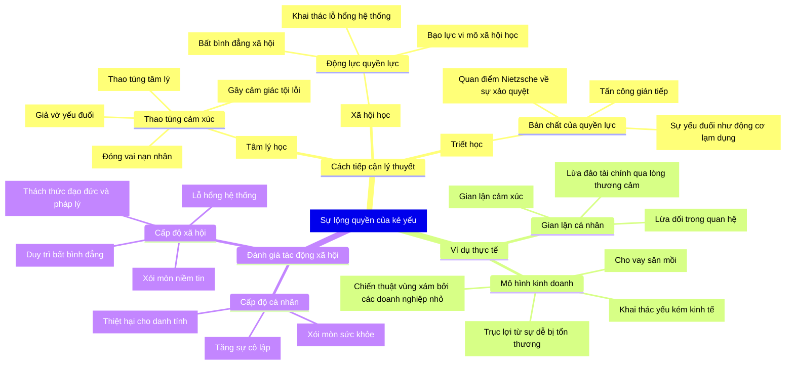

> Hôm nay, mình lướt mạng xã hội và bắt gặp cụm từ *Sự lộng quyền của kẻ yếu*, nguyên tác từ tiếng Hàn Quốc `약자의 횡포` có nghĩa là sự áp bức của kẻ yếu.
>
> *Chúng ám chỉ về sự vi phạm pháp luật hoặc làm hại người khác chỉ vì họ yếu đuối(cùng đường) và hành động vì mục đích kiếm sống (từ những người bán hàng rong, ăn xin hay thậm chí là lừa đảo v.v.)*

> Bài viết rất dài với nhiều góc nhìn, nên cân nhắc để hiểu trọn vẹn nội dung!
{: .note-important}

## Đôi lời mở đầu

Cụm từ *Sự lộng quyền của kẻ yếu* gây ấn tượng rất đậm với mình. Thập chí là ám ảnh. Nó khiến mình liên tưởng đến những câu chuyện gần đây ở Việt Nam như `mẹ bắp`, hay trước đó là `ăn chặn từ thiện`, một số tổ chức dùng danh nghĩa từ thiện (charity/foundation) chạy quảng cáo với nội dung `xxx need your helps` để khai thác tài chính bằng niềm tin và lòng trắc ẩn... hay KoL/Influencer review xấu về dịch vụ sản phẩm nào đó nhằm tìm kiếm quyền lợi từ thương hiệu, doanh nghiệp.

Chắc ít ai còn nhớ vụ lùm xùm trước đây của Dr.Thanh tại Việt Nam với `con ruồi trong chai nước ngọt` cùng một số ít nhà báo khai thác sức mạnh ngôn từ hòng trục lợi từ doanh nghiệp.

Thoạt nhìn thì có vẻ như chúng chỉ là sự lừa đảo thôi, nhưng khi mình tìm hiểu sâu hơn về vấn đề này và phát hiện ra, hành vi này có thể xem là một kiểu phản ứng đặc trưng của một nhóm người, có quy luật, và đang có xu hướng phát triển, có thể trở thành vấn nạn trong xã hội hiện đại; mặc dù trước đó chưa từng xuất hiện trong lịch sử nhân loại... hoặc có thể chưa được định nghĩa đầy đủ và đúng mức độ về nó.

Mình đã tìm kiếm các tài liệu về xã hội và những cụm từ liên quan bằng tiếng Anh -*The abuse of power by the weak* nhưng chỉ có một vài khái niệm không đầy đủ của triết học[^1], tâm lý[^2] và chính trị[^3].

> *Bài viết này có thể tạo ra tác động lớn, hoặc cũng có thể sẽ bị chôn vùi trong lịch sử rồi trở thành nguồn nguyên liệu ngôn từ và tư duy logic về xã hội loài người cho AI.*

> *Nếu vậy thì thật là tiếc...*

---

{: lqip="data:image/webp;base64,UklGRmIAAABXRUJQVlA4IFYAAAAwAgCdASoQAAsABUB8JaACdADdqNEudDsQAAD+aj+S3cf/EOm5Ioyc38pVKyr7laUZCmYYC0J9hHXoKsQcfQVUZDFSApEvMZos8qPVWsoGLqBSyqAAAA=="} _Cuộc sống - Hải Thanh_

Thông thường, mọi người đều nghĩ quyền lực là thứ của kẻ mạnh; hoặc quyền lực chỉ có trong tay những kẻ mạnh—những người áp đặt sự thống trị lên người yếu thông qua quyền hạn, tài nguyên hoặc sức ảnh hưởng.

Tuy nhiên, bên dưới bề mặt này tồn tại kiểu hành vi khác: những cá nhân/nhóm người sử dụng sự yếu đuối, bất hạnh của mình như vũ khí để thao túng, bóc lột và kiểm soát người khác một cách tinh vi và hiệu quả đến mức mang đến sự tàn phá.

Có lẽ nên xem xét tính chất vấn đề để có góc nhìn đa diện: Từ gian lận tình cảm trong các mối quan hệ thân thiết đến các mô hình kinh doanh mang tính chất săn mồi, mọi người sẽ thấy *cách sự yếu đuối trở thành công cụ chiến lược để giành lợi thế trước những người sở hữu các hình thức quyền lực truyền thống.*




## Nghịch lý

Sự lạm dụng quyền lực của kẻ yếu thế thể hiện sự đảo ngược cơ bản của cách sử dụng quyền lực truyền thống. Không giống như lạm dụng thông thường nơi sức mạnh thống trị sự yếu đuối, hiện tượng này liên quan đến việc khai thác một cách có tính toán sự dễ bị tổn thương của chính mình để giành lợi thế trước người khác. Đây là một dạng "aikido tâm lý"—sử dụng sức mạnh của đối thủ chống lại họ bằng cách tỏ ra bất lực trong khi dàn dựng các hoạt động thao túng tinh vi.

Hành vi này khác biệt rõ rệt so với chủ nghĩa cơ hội đơn thuần. Nó liên quan đến những nỗ lực có chủ ý, kéo dài để khai thác lòng trắc ẩn, cảm giác tội lỗi hoặc nghĩa vụ xã hội của người khác dưới vỏ bọc là sự bất lực của kẻ yếu. Kẻ thao túng thể hiện ra bên ngoài rằng mình là nạn nhân hoặc người bảo vệ trong khi đồng thời lại thiết kế chính các tình huống như vậy để giành quyền lợi hoặc sự kiểm soát từ người khác.

Điều này tạo ra một nghịch lý:

Những người có quyền lực truyền thống bị ràng buộc bởi các kỳ vọng xã hội, khuôn khổ pháp lý và nghĩa vụ đạo đức - tuy nhiên, những điều này lại không thể áp dụng tương đương cho những người được coi là yếu thế - kẻ yếu thế.

Ví dụ:
- Đơn giản: Một người vô gia cư có thể phóng uế giữa đường, hay ăn vạ một doanh nhân lớn để kiếm tiền, nhưng ngược lại thì không. Xã hội và quan niệm đạo đức có thể chấp nhận hành động của kẻ vô gia cư đó, nhưng lại không chấp nhận nếu đó là vị doanh nhân kia.
- Sâu hơn: Một người quản lý sẽ phải chịu trách nhiệm về việc bộ phận không đạt KPI tại nơi làm việc, nhưng một nhân viên hay một thực tập sinh có thể sử dụng cảm xúc để thao túng người quản lý với những đặc quyền để ít bị giám sát hoặc giảm mức KPI phải chịu.
- Hiển nhiên: Các động thái về tài chính của một người giàu có thường bị soi xét và đưa lên truyền thông (Việt Nam: Trần Đình Long, Phạm Nhật Vượng), trong khi một người tự nhận là nghèo khó (Việt Nam: mẹ bắp) có thể tận dụng lòng thương cảm để trích xuất tài nguyên (từ người ủng hộ/hỗ trợ) mà không phải chịu sự giám sát tương đương.

## Lý thuyết

### Tâm lý học: chiến tranh cảm xúc

Từ góc độ tâm lý, sự lộng quyền của kẻ yếu thế hoạt động thông qua việc thao túng cảm xúc, đa phần dựa trên việc khai thác các xu hướng cơ bản của con người hướng tới lòng trắc ẩn, và đạo đức xã hội.

Hành vi thao túng sử dụng một số cơ chế chính:

**Tự biến mình thành nạn nhân**: Kẻ thao túng tự xây dựng hình tượng bản thân là nạn nhân và duy trì có chủ ý trạng thái nạn nhân nhằm đạt được sự nhượng bộ từ người khác. Họ không hẳn là kẻ yếu, nhưng họ lại khai thác vị thế kẻ yếu bằng việc xây dựng một cách có hệ thống các câu chuyện nhằm định vị chính họ là nạn nhân.

**Thao túng tâm lý (Gaslighting)**: Hành vi khai thác sự mâu thuẫn nhận thức của nạn nhân và trói buộc họ. Nạn nhân sẽ cảm thấy tội lỗi nếu cho rằng một người dường như vô hại/bất hạnh đang thao túng/kiểm soát chính mình.

**Khủng bố cảm xúc**: Hành vi này thể hiện bằng cách đe dọa tự làm hại bản thân, biểu hiện cảm xúc kịch tính, hoặc các hành vi khác nhằm tạo ra tình huống khủng hoảng đòi hỏi sự chú ý và tuân thủ ngay lập tức từ phía nạn nhân.

Đa phần, những kẻ thao túng như vậy thể hiện năng lực trí tuệ cảm xúc cao, nhưng có vẻ như họ lại thiếu đi lòng tự trọng đích thực.

### Xã hội học: quyền lực như một loại tiền tệ

Dưới góc nhìn của xã hội học, việc kẻ yếu thế có thể lạm dụng quyền lực khi họ biết cách khai thác sự không công bằng trong cấu trúc xã hội và kỳ vọng xã hội.

> Quyền lực là **thứ giúp đạt được mục tiêu bất chấp sự phản kháng**.
>
>Max Weber
{: .author }

Xã hội hiện đại tạo ra nhiều kẽ hở cho phép việc lạm dụng quyền lực của những người yếu thế:
- Hệ thống an sinh xã hội, mặc dù cần thiết để bảo vệ những nhóm người dân thực sự dễ bị tổn thương, nhưng có thể bị những kẻ thao túng lợi dụng để trục lợi.
- Các tiêu chuẩn xã hội như danh vọng, vị thế khiến những người theo đuổi và sở hữu nó dễ bị kẻ trục lợi bằng vị thế kẻ yếu/vỏ bọc bất hạnh để khai thác và lợi dụng thông qua cảm giác tội lỗi, nghĩa vụ xã hội.

Việc internet phát triển và các mạng xã hội phát triển thúc đẩy một kiểu xã hội mới, nơi mà mọi người đầu tư thời gian nhiều hơn cho các mối quan hệ ảo thay vì sự kết nối thật sự giữa người với người.

Nếu xem xét mối quan hệ về tỷ lệ các phi vụ lừa đảo, giá trị tài sản lừa đảo và sự phát triển xã hội và internet trong khoảng thời gian 30 năm trở lại đây tại Mỹ (1995-2025) sẽ nhận thấy sự tương quan nhất định về yếu tố xã hội:

```chart
{
  "type": "line",
  "data": {
    "labels": ["1995", "2000", "2005", "2010", "2015", "2020", "2025"],
    "datasets": [
      {
        "label": "Số khiếu nại gian lận/lừa đảo (ngàn)",
        "data": [100, 200, 300, 400, 500, 2200, 2600],
        "borderColor": "rgba(31, 119, 180, 0.3)",
        "backgroundColor": "rgba(31, 119, 180, 0.4)",
        "fill": false,
        "yAxisID": "y-left"
      },
      {
        "label": "Giá trị lừa đảo (tỷ $)",
        "data": [1.0, 2.0, 3.5, 4.0, 6.1, 3.5, 12.5],
        "borderColor": "rgba(255, 127, 14, 0.3)",
        "backgroundColor": "rgba(255, 127, 14, 0.4)",
        "fill": false,
        "yAxisID": "y-right"
      },
      {
        "label": "Độ phủ Internet (%)",
        "data": [9, 43, 68, 74, 87, 90, 92],
        "borderColor": "rgba(44, 160, 44, 0.4)",
        "backgroundColor": "rgba(44, 160, 44, 0.4)",
        "fill": false,
        "yAxisID": "y-right"
      },
      {
        "label": "Thu nhập (ngàn $)",
        "data": [50.0, 70.8, 70.2, 67.5, 70.2, 74.6, 76.0],
        "borderColor": "rgba(148, 103, 189, 0.4)",
        "backgroundColor": "rgba(148, 103, 189, 0.4)",
        "fill": false,
        "yAxisID": "y-left"
      }
    ]
  },
  "options": {
    "responsive": true,
    "scales": {
      "x": {
        "title": {
          "display": true,
          "text": "Năm"
        }
      },
      "y-left": {
        "type": "linear",
        "position": "left",
        "title": {
          "display": true,
          "text": "Số khiếu nại gian lận (ngàn) / Thu nhập (ngàn $)"
        },
        "grid": {
          "drawOnChartArea": false
        }
      },
      "y-right": {
        "type": "linear",
        "position": "right",
        "title": {
          "display": true,
          "text": "Giá trị gian lận (tỷ $) / Độ phủ internet (%)"
        },
        "grid": {
          "drawOnChartArea": false
        }
      }
    },
    "plugins": {
      "title": {
        "display": true,
        "text": "Tương quan về sự gian lận chiếm đoạt tài sản với thu nhập và sự phát triển của internet (1995-2025)"
      },
      "legend": {
        "display": true,
        "position": "top"
      }
    }
  }
}
```
**Notes**:

- **Khiếu nại gian lận**: Các giá trị ước tính; dữ liệu của FTC cho thấy 2,4 triệu $ vào năm 2022, 2,6 triệu $ vào năm 2023.
- **Tổn thất do gian lận**: Ước tính ban đầu; FTC báo cáo 3,5 tỷ $ vào năm 2020, 8,8 tỷ $ vào năm 2022, 10 tỷ $ vào năm 2023, với dự báo cho năm 2025 dựa trên xu hướng tăng trưởng.
- **Sự thâm nhập của Internet**: Nguồn từ NTIA và Pew.
- **Thu nhập**: Nguồn từ Pew Research.
 
*Mỹ như một vườn ươm thần kỳ về sự phát triển nhanh chóng internet trong 30 năm qua (1995-2025) về tài chính cũng như sự thông thoáng về pháp lý/chính sách an sinh nên mình thấy rất phù hợp để lấy số liệu cho ví dụ dẫn chứng. Các quốc gia khác rất khó tiếp cận số liệu.*

### Triết học: khi sự yếu đuối là động cơ

> Kẻ yếu thế có thể lạm dụng sự yếu thế của mình dưới dạng quyền lực đạo đức để chống lại kẻ mạnh.
> 
Friedrich Nietzsche - Đạo đức nô lệ-Slave morality
{: .author }

John Adams cho rằng "sự yếu đuối chứ không phải sự gian ác khiến đàn ông không đủ tư cách để được tin tưởng giao phó quyền lực vô hạn-*weakness rather than wickedness renders men unfit to be trusted with unlimited power*" - Vấn đề ở đây có lẽ không nhất thiết là ý định xấu mà là những hành vi nhằm bù đắp sự tuyệt vọng xuất phát từ cảm giác bất lực của họ trước điều gì đó.

Xét theo tính chất cá nhân, dóc nhìn này cho thấy sự lộng quyền của kẻ yếu thế có thể không phải là hành vi của cái ác có tính toán mà là một phản ứng bệnh lý nhằm tự vệ trước sự bất lực thực sự. Bởi, khi đã ở đường cùng và chẳng còn gì có thể tệ hơn nữa, thì họ cũng chẳng còn quan tâm những thứ cao xa hơn như danh dự hay lòng tự trọng.

Sự bất hạnh là có thật—phản ứng bản năng của họ đối với điều đó trở thành nguồn gây hại cho người khác.

Vậy tính xác thực và trách nhiệm thì sao:
- Khi nào sự bất hạnh lại trở thành sự diễn kịch có chủ ý? Lợi ích hay đạo lý?
- Làm thế nào để chúng ta duy trì lòng trắc ẩn đối với những người bất hạnh và tránh khỏi những kẻ muốn lợi dụng lòng trắc ẩn đó?

Những câu hỏi này không dễ có câu trả lời...

## Biểu hiện thực tế

### Tình cảm: Các mối quan hệ trong bối cảnh thân thiết

**Gian lận tình cảm** trong các mối quan hệ tình cảm thường liên quan đến một đối tác (hoặc người) giả vờ yếu đuối một cách có chủ ý để khai thác tài nguyên, sự chú ý hoặc quyền kiểm soát từ đối tác kia. Điều này có thể biểu hiện dưới dạng khó khăn tài chính (phóng đại), các vấn đề sức khỏe bịa đặt, hoặc các biểu hiện khủng hoảng cảm xúc được tạo ra nhằm đòi hỏi sự chú ý và nhượng bộ liên tục. Kẻ thao túng tạo ra một động lực nơi mà tình yêu và sự cam kết của đối tác trở thành vũ khí chống lại chính hạnh phúc của họ.

**Sự lệ thuộc** dựa trên sự mềm lòng của cha mẹ đối với các thành viên trong gia đình—dù là thật hay diễn—đều có thể trở thành cơ chế để khai thác như sức lao động, sự vỗ về cảm xúc hoặc nguồn lực tài chính, khiến họ cảm thấy có nghĩa vụ và trách nhiệm phải giúp đỡ. Điều này đặc biệt phổ biến ở văn hoá phương Đông như Việt Nam.

**Khai thác tình bạn** liên quan đến việc sử dụng khủng hoảng cá nhân, khó khăn tài chính hoặc nhu cầu tình cảm để khai thác tài nguyên, sự ưu ái hoặc sự hỗ trợ trực tiếp từ bạn bè mà không có sự đáp lại.

Sự thao túng ở góc độ thân mật này đặc biệt có hại vì chúng khai thác nhu cầu sâu sắc nhất của con người về sự kết nối, ý nghĩa và thậm chí là lý tưởng sống.

### Kinh tế: kiếm tiền từ sự bất hạnh

Ví dụ dễ nhận thấy nhất có lẽ ở hoạt động kinh doanh; có nhiều ví dụ về cách mà sự bất hạnh/sự yếu đuối/sự cần được bảo vệ/hỗ trợ được sử dụng để nhắm vào khai thác về lợi ích kinh tế.

**Cho vay nặng lãi** là một ví dụ rõ nét về việc các doanh nghiệp/tổ chức tài chính cho vay ngắn hạn (trả góp), các mô hình thuê để sử dụng và các hoạt động/hình thức cho vay dưới chuẩn(cầm cố tài sản/cầm đồ) đều tự cho mình là bên giúp đỡ/hỗ trợ những người không thể tiếp cận các dịch vụ tài chính truyền thống trong khi chính họ lại đang khai thác lợi nhuận thông qua các điều khoản bóc lột, một phần tạo ra bẫy nợ nần nhằm khai thác nhiều giá trị hơn hẳn giá trị ban đầu mà họ cung cấp.


**Mô hình kinh doanh dựa trên lòng thương cảm** liên quan đến các doanh nghiệp/cá nhân kiếm tiền từ chính sự khó khăn/bất hạnh của bản thân họ hoặc người khác thông qua hoạt động gây quỹ/quyên góp cộng đồng. Họ cũng có thể xây dựng hình tượng nhân vật và câu chuyện với mô-típ và lời kêu gọi giúp họ vượt qua nghịch cảnh. Mặc dù điều này là hợp pháp, nhưng mô hình này lại tạo ra động cơ để những kẻ trục lợi có cơ hội lợi dụng nhằm mục đích tài chính.

**Khai thác các lỗ hổng về quy định/chế tài pháp lý** có thể gọi là vùng xám của các doanh nghiệp/tổ chức trong kinh doanh. Bởi đối với các công ty nhỏ và lĩnh vực kinh doanh mới, thường các cơ quan quản lý chưa có chính sách rõ ràng để áp dụng vì doanh nghiệp/tổ chức *“quá nhỏ để áp dụng”* trong bối cảnh thị trường *”quá lớn để xử lý đơn lẻ”*. Tuy nhiên họ vẫn hoạt động và kiếm lợi nhuận từ lỗ hổng thay vì bị cấm.

>Trước 2023 tại Việt Nam, việc cá nhân chạy xe công nghệ như Uber/Grab hay bán hàng trên các kênh online như Shopee/Lazada chưa được quy định là một nghề nghiệp, đồng nghĩa với việc người bán/người chạy không phải đóng thuế thu nhập và bảo hiểm.
{: .note-info}

### Qua mặt hệ thống: trục lợi

Nếu sự yếu đuối/sự bất hạnh của nhiều người được điều khiển và khai thác bởi một nhóm/cá nhân có sự hiểu biết nhất định về cách thức tổ chức và quản trị thì sao?

Có lẽ điều đáng lo ngại nhất xảy ra khi một đàn cừu được một con sói dẫn dắt. 

Bạn chắc còn nhớ tới chính sách dẹp sạch vỉa hè của Đinh La Thăng tại Hồ Chí Minh rất được bà con hưởng ứng? Bỏ qua câu chuyện thực hiện ra sao, hãy quay lại và liên tưởng với câu chuyện những người yếu thế chiếm cứ vỉa vè bán hàng rong, làm bãi đậu xe và chống chế với lý lẽ kiếm sống; tuy nhiên sự thật đằng sau đó, họ có lẽ chỉ là người đại diện để thực hiện việc kiếm tiền thay cho người thao túng.

{: lqip="data:image/webp;base64,UklGRmIAAABXRUJQVlA4IFYAAADQAQCdASoQAA8ABUB8JZACdADRq8kIAAD+QMrb64PjxE+5sCGA5bHBfsWlEpmnMBkZi1+e2r77KXt+pjYTpfJyApOA1a7LzAbS2RT0WdvQ6XZzT8AAAA=="} _Kẻ trục lợi_

**Thao túng hành chính** là khi kẻ thao túng qua mặt các chính sách, hệ thống quản lý, hoặc các cơ chế hỗ trợ người dân thông qua việc trục lợi hoặc gian lận lợi ích từ chính những người đáng ra được nhận hỗ trợ.

**Khai thác hệ thống pháp lý** là việc biến các điều luật, chính sách thành vũ khí để trục lợi hoặc kiểm soát người khác. Cái này ở Việt Nam ít thấy, ở các nước phát triển như phương tây thì khá phổ biến với các hình thức biểu tình, quấy rối và cản trở hành pháp. Điều này có thể được sử dụng dưới dạng vỏ bọc cho hành vi thao túng. Rất khó để phân biệt và kiểm soát.

**Huy động chính trị** đây là việc các nạn nhân hoặc kẻ trục lợi có thể biến những bất bình chính đáng thành công cụ để giành quyền lực chính trị hoặc tài nguyên vượt xa việc giải quyết các vấn đề ban đầu. Việt Nam chúng ta là một đất nước với nhiều dân tộc anh em, nhưng có một số ít tổ chức khai thác đặc quyền của nhóm dân tộc thiểu số và điều hướng sang hoạt động chính trị nhằm trục lợi. Điển hình là các vụ bạo động tại Tây Nguyên. Mình từng trực chiến khi tham gia đào tạo và làm việc tại Bộ Chỉ Huy Quân Sự Quân Khu V nên nắm khá rõ những sự kiện này.

## Nguồn gốc và các yếu tố thúc đẩy

### Bất bình đẳng kinh tế


{: lqip="data:image/webp;base64,UklGRkYAAABXRUJQVlA4IDoAAADQAQCdASoQAAwABUB8JQAAT/vnnBNAAAD+70pWRt3xQC7BU0rRlL1w0NaPUdyP6l4Cv2YQ3428AAAA"} _Sự nghèo đói - Ben Koorengevel_

Sự chênh lệch tài sản đáng kể tạo ra điều kiện lý tưởng cho sự lộng quyền của kẻ yếu. Bởi khi việc sinh tồn cơ bản trở nên khó khăn, một số cá nhân có thể tận dụng sự bất hạnh của họ để đòi hỏi từ người có nhiều tài nguyên hơn. Bạn có thể liên tưởng đến nhân vật Chí Phèo - trong tác phẩm cùng tên của nhà văn Nam Cao.

**Cảm giác có trách nhiệm về sự giàu có** của những người khá giả hơn là có thật. Văn hoá Á đông của người Việt hầu như đều tin vào nhân duyên và phước lành, vì vậy họ luôn trong tâm thế có trách nhiệm với những vận mệnh ít may mắn hơn mình khi `tình cờ` gặp phải. Điều đó có thể trở thành kịch bản lý tưởng để nhận được sự giúp đỡ từ những người có chủ ý.

Bạn có thể liên tưởng đến những cô bé, cậu bé bán vé số, ăn xin, thổi lửa xuất hiện tại các thành phố lớn ở Việt Nam. Đứng sau những mảnh đời bé nhỏ đó, là cả một tổ chức có tính hệ thống.

###  Sự chuyển dịch văn hóa
Dù có phát triển tới đâu, lịch sử vẫn luôn ở phía sau. Sự nhạy cảm ngày càng tăng của văn hóa đương đại đối với các câu chuyện nạn nhân và bất công lịch sử càng rõ nét. Bởi sự tiến bộ đạo đức phát triển, tiêu chuẩn đạo đức cũng càng cao hơn, điều này càng tạo ra khoảng cách - cơ hội mới cho những kẻ thao túng.

**Văn hóa trị liệu** ... chắc mọi người ít nhiều cũng nghe qua từ `chữa lành` - `healing`. Thế giới phát triển, mọi người cũng nhận thức rõ hơn về khái niệm sức khoẻ tinh thần/tâm thần. Để chữa lành những vết thương tinh thần, không có nhiều cách hữu dụng hơn việc đối diện trực tiếp nó và chia sẻ để được tư vấn hỗ trợ. Vấn đề ở đây là nhu cầu cảm xúc trong quá trình điều trị có thể bị khai thác và thao túng bởi những người hiểu cách diễn đạt ngôn ngữ trị liệu nhưng không hoàn toàn tham gia vào việc chữa lành thực sự. Khó khăn trong việc điều trị tổn thương tâm lý hoặc nhu cầu cảm xúc được chia sẻ của ai đó lại là vỏ bọc cho hành vi thao túng.

### Công nghệ là chất xúc tác

Từ ngày có mạng xã hội, bất kỳ ai cũng có thể trở nên nổi tiếng chỉ sau một đêm. 
Công nghệ truyền thông số đã mở rộng đáng kể phạm vi và hiệu quả của các chiến thuật thao túng quyền lực bởi kẻ yếu thế.

**Chiến dịch khai thác lòng thương cảm trên mạng xã hội** có thể huy động đông đảo người hỗ trợ xung quanh các khủng hoảng cá nhân bịa đặt hoặc phóng đại, tạo ra hỗ trợ tài chính, áp lực xã hội lên các mục tiêu, hoặc tạo dựng sự chú ý nhằm lan truyền hay cung cấp các hình thức ảnh hưởng khác nhau. Hãy liên tưởng đến câu chuyện `mẹ bắp`, `Phạm Thoại`; Người cần được giúp đỡ là có thật, với vẻ ngoài yếu đuối, dường như vô hại, nhưng cuối cùng lại là kẻ hưởng lợi.

**Thao túng cảm xúc số** hoạt động thông qua các bài trình bày trực tuyến được sắp xếp cẩn thận và có chủ địch về sự yếu thế để tạo sự chú ý, khai thác tài nguyên hoặc điều hướng hành động từ người theo dõi, bạn bè hoặc đối tượng tình cảm. Bạn có thể liên tưởng đến KoL/nhà báo trục lợi từ việc làm xấu hình ảnh về dịch vụ hoặc sản phẩm của nạn nhân.

**Gian lận gây quỹ cộng đồng** đại diện cho việc kiếm tiền có hệ thống từ các câu chuyện khó khăn bịa đặt, tận dụng khó khăn trong việc xác minh các tuyên bố trực tuyến và áp lực xã hội chống lại việc đặt câu hỏi về các nạn nhân rõ ràng. Bạn có thể nhớ đến chuyện ca sĩ làm từ thiện...

## Hậu quả và tác động

Chúng ta rất khó phân biệt giữa thật/giả để biết đâu là người thực sự cần được giúp đỡ. Trải qua việc bị lừa dối và lợi dụng, khiến xã hội ít sẵn lòng giúp đỡ những người có nhu cầu và khó khăn thực sự.

### Thiệt hại tâm lý

**Mâu thuẫn nhận thức** xuất hiện khi nạn nhân bị mâu thuẫn giữa sự bất lực rõ ràng của kẻ thao túng và quyền kiểm soát thực tế của họ đối với tình huống. Nạn nhân đấu tranh để dung hòa lòng trắc ẩn của họ đối với người dường như đang đau khổ/bất hạnh nhưng lại có sự ngờ vực về những đòi hỏi khác lạ của kẻ bất hạnh.

**Mệt mỏi vì lòng trắc ẩn** phát triển khi nạn nhân trở nên kiệt quệ về mặt cảm xúc bởi những yêu cầu, đòi hỏi liên tục về sự hỗ trợ, sự chú ý hoặc sự nhượng bộ. Điều này có thể dẫn đến khó khăn lâu dài trong việc hình thành các mối quan hệ tin cậy hoặc phản ứng thích hợp với nhu cầu thực sự ở người khác.

**Xói mòn giá trị đạo đức** xảy ra khi nạn nhân mất niềm tin và không còn khả năng phân biệt thật/giả, dẫn đến sự hoài nghi và trở nên dửng dưng về sự tử tế hay những người gặp khó khăn/bất hạnh thực sự.

### Suy giảm niềm tin xã hội

**Hoài nghi lòng trắc ẩn** nổi lên khi mọi người trở nên thận trọng hơn với các tuyên bố/chia sẻ về lời kêu gọi sự trợ gíup, có khả năng làm giảm sự hỗ trợ từ xã hội cho những người thực sự gặp khó khăn. Điều này tạo ra một kết quả đặc biệt sai lệch, nơi hành động của những kẻ thao túng không chỉ gây hại cho nạn nhân trực tiếp của họ mà còn cho những người thực sự cần giúp đỡ.

**Rối loạn thể chế** phát triển khi các tổ chức đấu tranh để duy trì các hệ thống hỗ trợ cho các nhóm người yếu thế dễ bị tổn thương trong khi bảo vệ chống lại sự thao túng. Khó khăn trong việc phân biệt dẫn đến sự vận hành của các tổ chức trở nên cồng kềnh nhưng lại thiếu hiệu quả.

**Suy thoái dân chủ** có thể xảy ra khi các nạn nhân trở thành công cụ cho sự thao túng chính trị.

### Biến dạng kinh tế

Việc qua mặt các hệ thống/tổ chức tạo ra các khối kinh tế ít hiệu quả và phân bổ sai lệch tài nguyên.

**Thất bại thị trường** xuất hiện khi các doanh nghiệp thành công thông qua thao túng lòng thương cảm thay vì cung cấp giá trị thực sự, làm méo mó động lực cạnh tranh và giảm hiệu quả kinh tế tổng thể.

Sau khi xem giá món đồ cần mua trên Shopee ngày siêu sale 5/5 vừa qua, mình không còn tin vào thứ giảm giá thực sự trên đó nữa. Lazada có thể bán giá rẻ, nhưng tới tay bạn thì phí ship chiếm phần lớn chi phí một cách vô lý...

> Ví dụ đó nghe ít liên quan, nhưng bản chất vấn đề ở đây, là các nhà bán hàng cá nhân lợi dụng vùng xám của thị trường. Họ quá nhỏ để đăng ký chương trình khuyến mãi (giảm giá) với Sở Công Thương, và Shopee/Lazada lại quá lớn để làm thay họ điều đó. Hệ quả, bạn được mua hàng giá x>2 sau đó trừ đi 50% giá giảm.

> Ở EU có luật về giá bán và khuyến mãi, đại ý: giá khuyến mãi phải thấp hơn giá thấp nhất được bán trong 30 ngày gần nhất nhằm tránh hiện tượng nâng khống giá bán rồi giảm giá ảo.
{: .note-info }

**Phân bổ tài nguyên sai lệch** xảy ra khi các hệ thống hỗ trợ bị kiểm soát bởi những kẻ thao túng. Điều này làm giảm hiệu quả của các hệ thống an sinh xã hội và có khả năng tạo ra phản ứng chính trị chống lại các chương trình như vậy. Cái này nhạy cảm, bạn có thể liên tưởng qua trường hợp `Việt Á` thời điểm Covid cùng những chuyến bay giải cứu.

## Biện pháp
### Chiến lược cá nhân
**Thiết lập ranh giới** liên quan đến việc học cách duy trì sự đồng cảm trong khi bảo vệ bản thân khỏi sự thao túng. Điều này đòi hỏi phân biệt giữa việc hỗ trợ người khác và sự khai thác lòng trắc ẩn hoặc tài nguyên của họ. Ví dụ, nguyên tắc của mình là không bao giờ cho bạn mượn tiền.

**Kỹ năng nhận diện kịch bản** để xác định các hành vi có nhiều điểm chung để phân biệt người cần được giúp đỡ thực sự với những kẻ diễn xuất. Bạn có thể nhận ra khi các khủng hoảng của người được giúp đỡ xảy ra quá thường xuyên, khi các nhu cầu cần được hỗ trợ leo thang và đòi hỏi ngày một nhiều.

Từ 2018 đến hiện tại, mình đi phát cơm từ thiện cho người vô gia cư tại Hồ Chí Minh - tổ chức nấu và trực tiếp đi phát, mình có thể nhìn ra đâu là những gương mặt thân quen, đâu là những người mới đến, mình cũng biết được khu vực nào tồn tại những người thực sự cần, nơi nào tập trung nhiều diễn viên.

**Tìm sự hỗ trợ** để có thêm các góc nhìn từ bên ngoài có thể giúp nhận ra biểu hiện bị thao túng - thứ vốn rất khó xác định từ bên trong mối quan hệ.

### Cải cách tổ chức

Các tổ chức và hệ thống cần tối ưu cơ chế về cách tiếp cận và xử lý để vẫn hỗ trợ được cho các nhóm người cần trong khi kiểm soát được sự trục lợi.

**Hệ thống xác minh** để xác định giữa nhu cầu chân thực và kẻ lợi dụng nhưng vẫn duy trì sự tôn trọng về quyền riêng tư và phẩm giá.

**Cơ chế trách nhiệm** có thể tạo nên một rào cản để bảo vệ và duy trì tính đúng đắn cho những người thực hiện các hoạt động hỗ trợ người thực sự cần giúp đỡ. Điều này đòi hỏi các khung pháp lý và hành chính có thể phân biệt giữa sai lầm trung thực và sự thao túng mang tính chủ ý.

**Đào tạo nhận thức** cho các nhà cung cấp dịch vụ, thực thi pháp luật về cách nhận biết và các chiến lược phản ứng phù hợp.

### Phản ứng văn hóa và giáo dục

Nâng cao nhận thức là cần thiết để cân bằng sự cảnh giác trong khi không tạo ra sự vô cảm và thói dửng dưng trước những người bất hạnh/lòng tốt.

**Nhận thức truyền thông** bao gồm việc nhận diện các kịch bản có biểu hiện bị thao túng trên các kênh truyền thông.

**Giáo dục về mối quan hệ** bao gồm thông tin về các động lực mối quan hệ lành mạnh so với thao túng, giúp mọi người xác định và phản ứng phù hợp với các chiến thuật thao túng cảm xúc.

**Kỹ năng đồng cảm có tính phê phán** liên quan đến việc học cách duy trì lòng trắc ẩn trong khi phát triển sự hoài nghi và khả năng thiết lập ranh giới phù hợp.

## Tổng hợp và ý nghĩa

```chart
{
  "type": "radar",
  "data": {
    "labels": [
      "Thao túng cảm xúc",
      "Nạn nhân chiến lược",
      "Bóc lột tài chính",
      "Cưỡng chế xã hội",
      "Tận dụng sự dễ bị tổn thương",
      "Kiểm soát ngầm"
    ],
    "datasets": [
      {
        "label": "Tác động của lạm dụng quyền lực của kẻ yếu",
        "data": [8, 9, 7, 7.5, 9.5, 8.5],
        "backgroundColor": "rgba(255, 105, 180, 0.4)",
        "borderColor": "#ff69b4",
        "pointBackgroundColor": "#ff69b4",
        "pointBorderColor": "#fff",
        "pointHoverBackgroundColor": "#fff",
        "pointHoverBorderColor": "#ff69b4",
        "lineTension": 0.2
      },
      {
        "label": "Lạm dụng quyền lực truyền thống (so sánh)",
        "data": [6, 4, 9, 8.5, 5, 7],
        "backgroundColor": "rgba(0, 191, 255, 0.4)",
        "borderColor": "#00bfff",
        "pointBackgroundColor": "#00bfff",
        "pointBorderColor": "#fff",
        "pointHoverBackgroundColor": "#fff",
        "pointHoverBorderColor": "#00bfff",
        "lineTension": 0.2
      }
    ]
  },
  "options": {
    "responsive": true,
    "maintainAspectRatio": false,
    "scales": {
      "r": {
        "angleLines": {"color": "#888888"},
        "grid": {"color": "#888888"},
        "pointLabels": {
          "color": "#888888",
          "font": {"size": 14}
        },
        "ticks": {
          "beginAtZero": false,
          "backdropColor": "rgba(0, 0, 0, 0)",
          "color": "#888888",
          "font": {"size": 12},
          "stepSize": 1,
          "min": 3
        }
      }
    }
  }
}
```

Sự lộng quyền của kẻ yếu đại diện cho một thách thức xã hội hiện đại về sự áp bức và bị trục lợi. Nó cho thấy cách mà sự yếu đuối có thể được khai thác bởi những người hiểu biết để biến sự yếu đuối đó thành vũ khí chống lại lòng trắc ẩn và nghĩa vụ xã hội của người khác.

Bài viết này không nhằm làm thay đổi giá trị hay các mối quan ngại về việc lạm dụng quyền lực truyền thống hoặc gợi ý rằng chúng ta nên trở nên ít trắc ẩn hơn đối với những người bất hạnh. Thay vào đó, là phát triển nhận thức nhằm phân biệt giữa thật/giả để biết đâu là người thực sự cần được giúp đỡ —và phản ứng phù hợp cho cả hai. Điều này góp phần xây dựng những cộng đồng lành mạnh trong một xã hội phức tạp khi công nghệ xâm lấn quá sâu vào cuộc sống.

---

## Tham khảo
- [Healthline: How to Recognize the Signs of Emotional Manipulation and What to Do](https://www.healthline.com/health/mental-health/emotional-manipulation)
- [Verywell Health: Signs of Manipulation Used to Gain Power](https://www.verywellhealth.com/manipulative-behavior-5214329)
- [Psychology Today: 14 Signs of Psychological and Emotional Manipulation](https://www.psychologytoday.com/us/blog/communication-success/201510/14-signs-psychological-and-emotional-manipulation)
- [WebMD: Signs of Manipulation: Recognizing Manipulative Behavior](https://www.webmd.com/mental-health/signs-manipulation)
- [Exploring Your Mind: Manipulation: Using Other People's Weaknesses to Gain Power](https://exploringyourmind.com/manipulation-weaknesses-to-gain-power/)
- [Verywell Mind: Manipulative Behaviors: Signs, Types, Causes, Coping](https://www.verywellmind.com/what-is-manipulative-behavior-5220502)
- [Procap Detective: Offense of abuse of weakness: definition, constituent elements and evidence](https://www.procapdetective.com/en/post/offense-of-abuse-of-weakness-definition-constituent-elements-and-evidence)
- [Medium: You Don’t Need a Lot of Power to Abuse It - by Julie Diamond](https://medium.com/@julie_diamond/you-dont-need-a-lot-of-power-to-abuse-it-d6732d9b47e5)
- [Business.com: Understanding the Psychology of Power Abuse](https://www.business.com/articles/psychology-of-power-abuse/)
- [EBSCO Research Starters: Abuse of power](https://www.ebsco.com/research-starters/politics-and-government/abuse-power)


[^1]: **Triết học:** Friedrich Nietzsche từng đề cập đến khái niệm "đạo đức nô lệ" (slave morality) trong tác phẩm Về nguồn gốc của đạo đức (On the Genealogy of Morality), nơi ông cho rằng những kẻ yếu thế có thể sử dụng các giá trị như lòng trắc ẩn, sự khiêm nhường, hoặc cảm giác tội lỗi để thao túng và lật ngược quyền lực của những kẻ mạnh hơn.

[^2]: **Tâm lý học:** Khái niệm "victimhood culture" (văn hóa nạn nhân), được các nhà xã hội học như Bradley Campbell và Jason Manning đề cập trong cuốn The Rise of Victimhood Culture. Với việc tự nhận mình là nạn nhân (kẻ yếu) có thể trở thành một chiến lược để giành quyền lực đạo đức, thu hút sự chú ý, hoặc đòi hỏi sự bồi thường từ xã hội hoặc chính quyền.

[^3]: **Chính trị:** Ở phương tây, họ sử dụng khái niệm "welfare abuse" (lạm dụng phúc lợi) khi một số cá nhân hoặc nhóm lợi dụng các chính sách hỗ trợ người nghèo để trục lợi, chẳng hạn như khai khống thu nhập để nhận trợ cấp xã hội.
