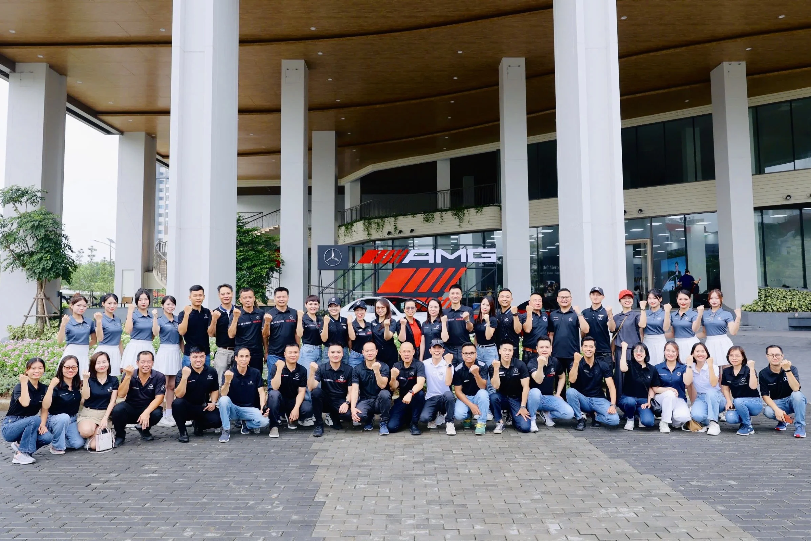
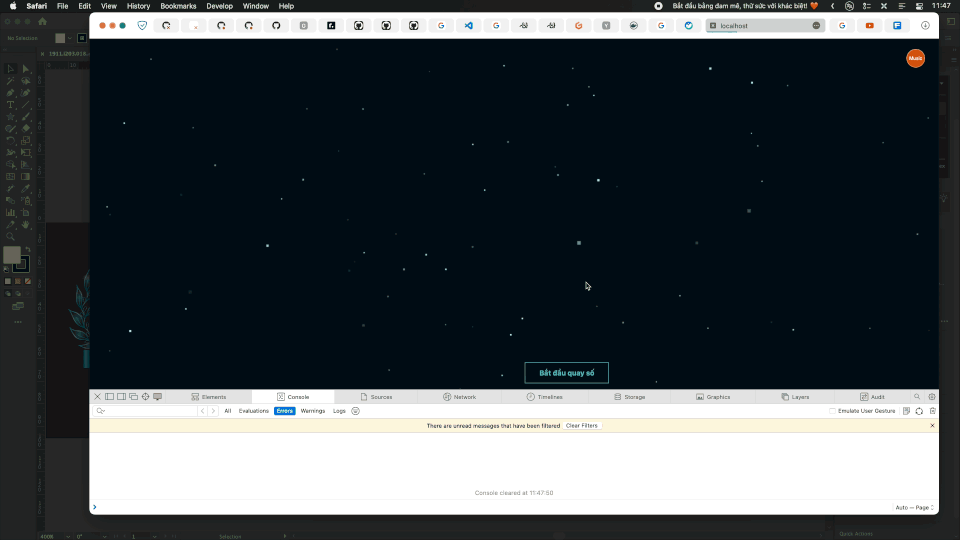
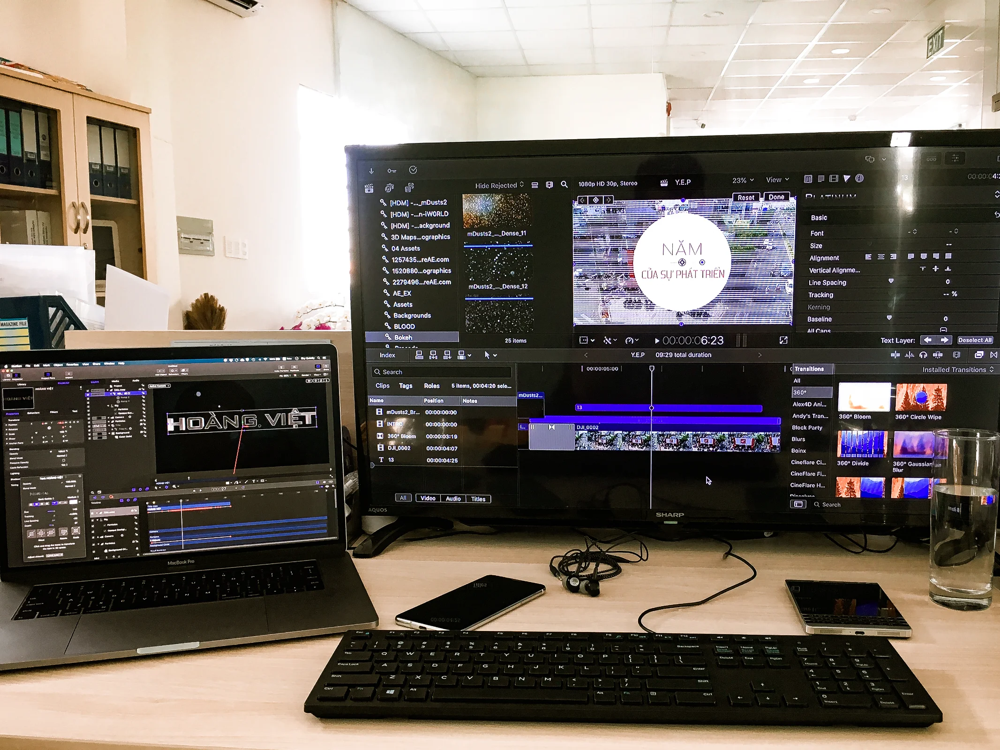
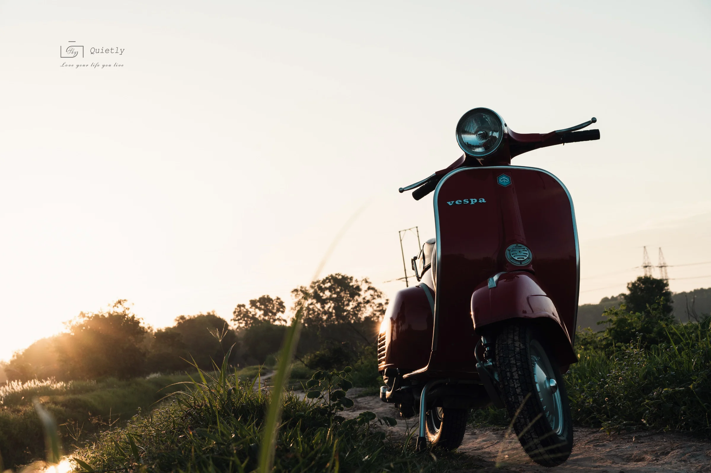

---
# the default layout is 'page'
title: About me
description: I work in the marketing industry. It’s tough, but I love keeping things simple. I enjoy figuring out how businesses work, reaching the journey, then adding real value—quietly doing my part, balancing purpose and profit.
icon: fa-solid fa-layer-group
order: 2
redirect_from:
  - /my-products
  - /marketing
  - /productions
  - /about-me/
  - /about-me
toc: true
---

{: lqip="data:image/webp;base64,UklGRuQAAABXRUJQVlA4WAoAAAAQAAAADwAADwAAQUxQSEcAAAARJ0CQbRubzRh2n0dE4BcUQpLkTB3C1wNEhBNI/lKfFCL6PwHQQwvQMjMFYlNaHsVO1U8rTprfcVI/LTvVdhJiU2ibAD20AABWUDggdgAAAFACAJ0BKhAAEAAFQHwljAAPk+23Csfmbh8MIAD+mA5w2Axhyf05RB5JYJN5twyUtGgcerUoGs2gOKyM4KjBEV4aOjWOjyQda0vQwt82MsgEYNMIHciC/yXbe/mqDi/rry7JtmGd4aeia+Wd4QN608YCmyWAAAA=" width="240"} _Just me, Steve_
I work in the marketing industry. It’s tough, but I love keeping things simple. I enjoy figuring out how businesses work, reaching the journey, then adding real value—quietly doing my part, balancing purpose and profit. Below is part of my milestone to learn and grow to now...

## B2C - A small start

### Vietnam’s first motorbike online store

{: lqip="data:image/webp;base64,UklGRkoAAABXRUJQVlA4ID4AAADwAQCdASoQAAsABUB8JQAAW7CpsM2NVAAA/t7OZeYxhcp2wU3CFuYmt1xN7ofAmI2Q4S5pNuT5IlRgJOQAAA=="} _Vietnam’s first motorbike e-commerce store_

{: lqip="data:image/webp;base64,UklGRp4AAABXRUJQVlA4WAoAAAAQAAAADwAACAAAQUxQSC8AAAARL0CWjRy0uPm2o3iGj4iY0KGqgQhqk0EA00GAVwPTv8x9SRDR/wnIQd3D+GeOAgBWUDggSAAAADACAJ0BKhAACQAFQHwljAJ0BicJibRfvqsAAP4F+FldwftsMajwTzD1p/3CZz0fgYan1kGEmdNcqxEsFaxpgn3wTpVveN2gAA==" width="420" .right}

In 2018, when e-commerce was growing in Vietnam, I tried something different—selling motorbikes online. It was a quiet hunch that worked out.

First sale came in two weeks. On 11.11, we hit 2 billion VND in a day. By year-end, Hoang Viet made over 1 trillion VND. It was a lesson in taking small risks.

### Video – A few moments

Some work bits stuck with me. Here’s a short video of a few things that happened along the way.



## Thai Khuong Song: A wave tune

{: lqip="data:image/webp;base64,UklGRlIAAABXRUJQVlA4IEYAAACwAQCdASoQAAsABUB8JQAAQuKNhowAAPzXHvzAILcBEIETaMTjsbCB0lhINUrjSqlPrZCqlyKsd5khRTqo5ezGYUxZSlIA" width="360" .left}

Inspired by the spirit of Thai Khuong, a place I consider a second home, this melody is my tribute. I hope it stirs the same passion and energy in others that I felt while creating it.

<iframe width="100%" height="360" scrolling="no" frameborder="no" allow="autoplay" src="https://w.soundcloud.com/player/?url=https%3A//api.soundcloud.com/playlists/1063996978&color=%23ff5500&auto_play=false&hide_related=false&show_comments=false&show_user=true&show_reposts=false&show_teaser=true"></iframe>

## Websites that work
{: lqip="data:image/webp;base64,UklGRloAAABXRUJQVlA4IE4AAAAwAgCdASoQAAwABUB8JQBOgCHdeXJ0gudAAAD+YW0nwzD9zPcA5zeJNS7NCRv2ybmJlcQ4Pi8fV1pQ42riNK0r+tkbMZhmJBZtAHQYAAA=" width="420"}_I reborn this site from 2019, SEO... then leave..._

### Keeping it useful

I’ve built and kept the sites simple, just focusing on what visitors need.

No fuss, just effort to make them helpful.

{: .d-flex .justify-content-center }
{: lqip="data:image/webp;base64,UklGRjoAAABXRUJQVlA4IC4AAADQAQCdASoQAAoABUB8JaQAAuhInKniAAD2t3We/1QKcUaZal4udWhqGL9eAAAA" .normal .me-2 }
{: lqip="data:image/webp;base64,UklGRjAAAABXRUJQVlA4ICQAAACwAQCdASoQAAkABUB8JZwAAud7hWAAAP7tTMK4RIdUEIOkAAA=" .normal }

### Content that matters

I think businesses should help people out. For complex stuff like stem cell therapy, I add clear info so customers can decide easily.

> Made for [Medeze](https://medeze.vn) in 2022, it’s about keeping things straightforward for users.
> 
{: .prompt-info }

## Some brochures and profiles

I’ve put together a few brochures and profiles for work. Here are ones I like:

  

    <iframe src="https://drive.google.com/file/d/1BerQAn-mQzwjKTKo-m8HqqL6y8iojidX/preview" class="w-100 h-100" style="min-height: 520px; border: 1px solid #ddd; border-radius: 5px;"></iframe>
  

  

    <iframe src="https://drive.google.com/file/d/1b1OMeqmvNW7yyOlMIgxSy4X24aa3Wzaw/preview" class="w-100 h-100" style="min-height: 520px; border: 1px solid #ddd; border-radius: 5px;"></iframe>
  

  

    <iframe src="https://drive.google.com/file/d/12n-nsfyAl--NMFHmVU__X7q1IxKkfvOf/preview" class="w-100 h-100" style="min-height: 360px; border: 1px solid #ddd; border-radius: 5px;"></iframe>
  

  

    <iframe src="https://drive.google.com/file/d/1UpH7tiuTO1O7KyHst8ZLFTNMHYc1cHBE/preview" class="w-100 h-100" style="min-height: 360px; border: 1px solid #ddd; border-radius: 5px;"></iframe>
  

## B2B - Building together

Thai Khuong Service came from small ideas and teamwork. I helped with things like uniforms and supporting the group—nothing loud, just steady work.

{: lqip="data:image/webp;base64,UklGRkYAAABXRUJQVlA4IDoAAADQAQCdASoQAAkABUB8JZQAAujc65pyYAD+sjFgpT7INiFxt9fImMSkz/aXRj8dWUB0RJALcCdAgAAA" }
_Thai Khuong Services_

{: .d-flex .justify-content-center }
{: lqip="data:image/webp;base64,UklGRkgAAABXRUJQVlA4IDwAAAAQAgCdASoQAAwABUB8JZwAAsWKfND7GkYAAPdQ1fI0C9oNdVmFQApSOjtABHABcxxDeSfZX3UCjRMAAAA=" .normal .me-2} 
{: lqip="data:image/webp;base64,UklGRl4AAABXRUJQVlA4IFIAAAAwAgCdASoQAAwABUB8JQBOgCHw6UfXuUBcAAD+wdJTEFnVS15+mFh7Ho8qDWH+divZm8c1IPUZLdV2p/EaTdqhbISd6RlL+of40ZsCB2clQAAA" .normal }

{: .d-flex .justify-content-center }
{: lqip="data:image/webp;base64,UklGRmwAAABXRUJQVlA4IGAAAAAwAgCdASoQAAsABUB8JbACdAEed9a57vO6AAD+3a+NwiXUIE8e4WIDLQfbWE4lynF/EBZjH2caiAeGErH1S2WNwYiPlfYuAWWBjd5BigLqLjVJYABALPNlUlumfqPQAAA=" .normal .me-2} 
{: lqip="data:image/webp;base64,UklGRlAAAABXRUJQVlA4IEQAAADQAQCdASoQAAsABUB8JZQAAtvFf9EzOAD+3ZuiFsSvulI+G67FcLj/t2hWlSySiGGiUzKHfFHmw1N64auLxGWpiXgAAA==" .normal }

## Watching things move

{: lqip="data:image/webp;base64,UklGRjoAAABXRUJQVlA4IC4AAABwAQCdASoQAAoABUB8JY0wAAHhAAD+75ErKwPyJR+LJ+z5uOCjdEhtB0ut/gAA"}

{: lqip="data:image/webp;base64,UklGRmIAAABXRUJQVlA4IFYAAABwAgCdASoQAAsABUB8JZgCw7YvXgf6b9NisWJQAP7mdtUbvbsFUUXHe4+1aufpD0xOgBIWtydWbhWlwBDk4HWznB+EM2Q8AdKQZQcVVSxjVUUjxJuAAA==" width="240" .right}

Marketing shifts fast. I use real-time data to watch it and adjust quietly—keeping things on track without much noise.

Work’s been a calm ride—learning as I go, and doing what I can.
[Goodbye, Thai Khuong...](/goodbye-thai-khuong)
## Each event stays with me

### Golf Membership Tournament 2022

{: lqip="data:image/webp;base64,UklGRkwAAABXRUJQVlA4IEAAAADQAQCdASoQABAABUB8JbACdADzewXSAAD8OfWf0gwpgttNRrABJa2cQE9o2cBuDbhvbiKVgvAfnQYMGH4qWUAA" width="480"} _A quiet moment on coures_

{: lqip="data:image/webp;base64,UklGRkoAAABXRUJQVlA4ID4AAAAQAgCdASoQAAoABUB8JagCdAD6GJeNQPQAAPjeVCUOGualvvqK/OnskzU+uL06nx/nTpmLtWl9oEEYS+IAAA=="} _A peaceful autumn scene at Long Bien Golf Course_

{: lqip="data:image/webp;base64,UklGRkQAAABXRUJQVlA4IDgAAABQAQCdASoQAAsABUB8JQAAHWoAAP68aS0HjRmUNXwJWIr8Gq320LTuhaO4W0k93Xp2dhL88sQAAA=="} _The Golf Tournament for Diamond Membership_

{: lqip="data:image/webp;base64,UklGRlwAAABXRUJQVlA4IFAAAADQAQCdASoQAAsABUB8JQBOgB6o9xYAAADN7GNgy6SFSCXnHMXyP5KyFQOCB2tAcFQNSwFH8BCKKcWmnHG/bazyj9Vl/XeIkJnWVeOBQUAAAA=="} _The Ruby Membership Trophy_

The [golf market in Vietnam](/golf-vietnam) from a marketing perspective.

### Mercedes-Benz STAR DRIVE 2024

{: lqip="data:image/webp;base64,UklGRkQAAABXRUJQVlA4IDgAAACQAQCdASoQAAsABUB8JYwC7ADNy+AA/qulqUGFMF33krW2z+OLL+jcswDMXNzcZg0PvBTO14AAAA=="} _The Mercedes-Benz test drive path_

{: lqip="data:image/webp;base64,UklGRlAAAABXRUJQVlA4IEQAAACQAQCdASoQAAsABUB8JYwAAUIA9YAA/NjpRttlIZILyP2IPfuAxMVrrmOTbgfy3OsOSNpxWKgqJlplVyqXt/WX7OHAAA=="} _The team behind the Mercedes-Benz event_

[Goodbye, Brad...](/goodbye-brad) CEO Mercedes-Benz Vietnam

## Make some shift... happen!
### Coding... 
I may not know software development, but I can understand how it works. Additionally, I can adjust it for myself or someone else!
_Lucky draw: the popular game for year-end parties in Vietnam._

### Design...
Although I'm not studying design, I can create 2D graphics for both vector and bitmap formats.

{: lqip="data:image/webp;base64,UklGRlYAAABXRUJQVlA4IEoAAACwAQCdASoQAAsABUB8JQAAXZrMM74AAP7KnWt68OhDHfwOzu5L3y5qRaAGMvqARJNOqvaGwSSdiOONWPKnsq/ReuDJltsTQtAAAA==" width="420"} _Card design template_

{: .d-flex .justify-content-center }
{: lqip="data:image/webp;base64,UklGRkgAAABXRUJQVlA4IDwAAADQAQCdASoQAAsABUB8JZACdAEOunCugAD+x3iwmmni/y7tmamkCV5D8aScUMsHSybyavmGZ1oTlj8AAAA=" .normal .me-2 }
{: lqip="data:image/webp;base64,UklGRlAAAABXRUJQVlA4IEQAAADwAQCdASoQAAsABUB8JZACdH8AGBrF0AAA/tYTFH4pSEWOZU/bvy7b5nU3iNIWMws+HdXH+CkDoSFIW6lDKgd5cAAAAA==" .normal }
### Video...
I rarely make video clips, even though most people are excited to see them. I find the process exhausting, as it takes a lot of time to combine content and emotions with sound and effects.

{: lqip="data:image/webp;base64,UklGRmgAAABXRUJQVlA4IFwAAAAwAgCdASoQAAwABUB8JZgCdAYwTjbWsm5gAAD+a94bijV2Gqwfa9pLxkn32SM7xgxd6SQoed2MB48fpRY/drY7sdPO54IlLndha6yuqkiBDTsbPLfIBnc7iEAAAA==" width="480"}

### Photography...
I enjoy photography and the process of creating images; each photo captures priceless moments.

{: lqip="data:image/webp;base64,UklGRkIAAABXRUJQVlA4IDYAAADQAQCdASoQAAsABUB8JbACdAEJKhC+AAD+022ac+J+8wgtyl+9m8dm3HLqv+DBKliasraAAAA=" width="480"}

{: .d-flex .justify-content-center }
{: lqip="data:image/webp;base64,UklGRlIAAABXRUJQVlA4IEYAAADwAQCdASoQAAsABUB8JbACdADdYHRXWnAA/uhG7hMKH4Wkv6EDCe8HYkhcXfoHDP2ftOgUR0qFTEE4xvaahFXTiW0RB4AA" .normal .me-2}
{: lqip="data:image/webp;base64,UklGRkwAAABXRUJQVlA4IEAAAADQAQCdASoQAAsABUB8JYwAApLJjHN6aAD+6jAo9vWwmXXnsYNenfzTYfmtdqMLYopkBeiy1Yj65IyWrvvBcgAA" .normal }

{: lqip="data:image/webp;base64,UklGRlYAAABXRUJQVlA4IEoAAADQAQCdASoQAAsABUB8JZwAAflcqKqxgAD87/g39ezW5Em295b4VHXx9WgDMrEj0Z/vWuJZNZGN2+ncGttWS1w6ZLFViRQ2nugAAA=="} _Jobs..._

{: .d-flex .justify-content-center }
{: lqip="data:image/webp;base64,UklGRlIAAABXRUJQVlA4IEYAAAAwAgCdASoQAAsABUB8JQBdgCHu0wWr5FuRgAD+79C+ogxYaR4oW5XA4/yZTrsyjgF+8WyNF9XHxvVU3Gw399gKh9sHr8AA" .normal .me-2}
{: lqip="data:image/webp;base64,UklGRlIAAABXRUJQVlA4IEYAAADQAQCdASoQAAsABUB8JbACdADQ9z1FwAD+6IzCtpl/lD6U0+nNVS8dBVP/NU6foZFpVGyxkJDa607nKNnASf8KWvn98GAA" .normal }

{: lqip="data:image/webp;base64,UklGRkoAAABXRUJQVlA4ID4AAAAQAgCdASoQAAsABUB8JZACdADHYmcdfvwAAP7c27JTVue8jfbZQ1XbXu5xUafaJUNRHGhaOFgFHlRSx43gAA=="} _I am who I am, I'm Steve!_
